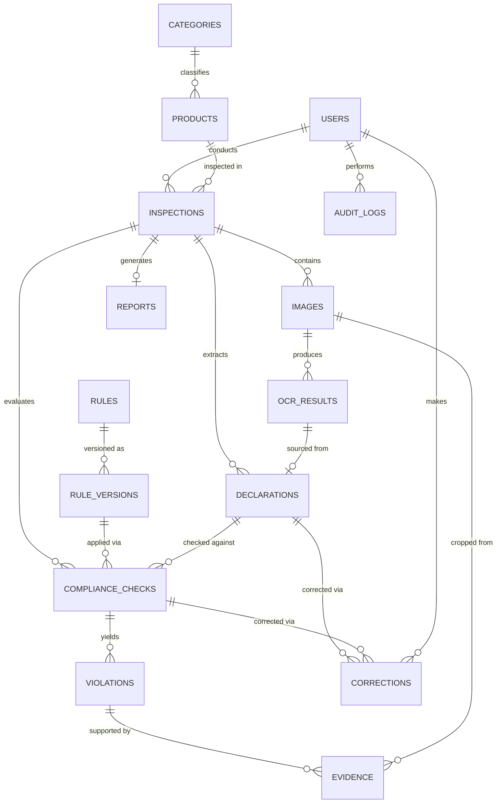

# PRD & Implementation Blueprint — SIH26034
**Software System to Check Compliance of Packaged Commodities under the Legal Metrology (Packaged Commodities) Rules, 2011**

Organization: Ministry of Consumer Affairs, Food & Public Distribution · Department of Consumer Affairs
Category: Software · Theme: Agriculture, FoodTech & Rural Development
Document version: 1.0 · Prepared for: Student development team, Day 1 → Grand Finale

> **Legal disclaimer (read first):** This document uses the Legal Metrology Act, 2009 and the Legal Metrology (Packaged Commodities) Rules, 2011 as the regulatory source of truth, including amendments notified through 2026 (see §2.4 and §12.6). Rule text summarized here is for **engineering design purposes only**. It is not legal advice, and this system must never be marketed as a legal authority. The rule engine (§12) exists specifically so that a qualified person — not the AI — enters and verifies the authoritative rule text before it is used to fail a product in a real inspection.

---

## 0. How to Use This Document

This PRD is written to be followed literally by a 6-person student team and by AI coding agents. Every functional requirement has acceptance criteria. Every schema is copy-pasteable. Where the official Problem Statement (PS) is silent, the requirement is explicitly labeled **[DERIVED]** or **[RECOMMENDED]** so the team never confuses "what SIH will grade us on" with "what we invented." Ambiguities are called out as **[AMBIGUOUS — SEE NOTE]** rather than silently resolved.

Legend used throughout:
- **[PS]** — stated directly in the official problem statement (Document 2)
- **[DERIVED]** — not stated, but required for [PS] items to function
- **[RECOMMENDED]** — improves the product/demo but is not required for a working submission
- **[OPTIONAL/INNOVATION]** — differentiator, build only after MVP is solid

---

## 1. Executive Summary

### 1.1 What SIH26034 is asking for
The Department of Consumer Affairs wants a software system that looks at photographs of packaged products (and, implicitly, e-commerce listings) and tells an enforcement officer whether the mandatory declarations required under the Legal Metrology (Packaged Commodities) Rules, 2011 — manufacturer/packer/importer identity, net quantity, MRP, date of manufacture/packing/import, consumer-care details, and other prescribed declarations — are present, correct, properly placed, and legible. The system must produce evidence-backed compliance reports, store inspection history, and give officials a dashboard.

### 1.2 The real-world problem
India has millions of SKUs across retail and e-commerce. Legal Metrology enforcement is currently manual: an inspector visually checks a package against a mental (or paper) checklist of ~10 rule clauses, across ~29 rules and multiple schedules, often under time pressure, and without image-based evidence that would hold up on appeal. This does not scale, is inconsistent between inspectors, and generates weak audit trails. E-commerce listings compound the problem because there is no physical package to inspect at all — only photos and text uploaded by the seller.

### 1.3 Who the users are
Field inspectors and senior enforcement officers (Legal Metrology Department, state Weights & Measures departments), department administrators who maintain rules and see aggregate compliance, and indirectly, manufacturers/packers/importers and e-commerce platforms who are the subjects of inspection. Consumers are a downstream beneficiary but are **not** a direct user of the MVP (see §3 ambiguity note).

### 1.4 What the proposed system does
Ingests package/label photographs (and optionally e-commerce listing data), runs a CV+OCR pipeline to detect and read declaration text, classifies the product to determine which rule clauses apply, runs those clauses through a versioned, data-driven rule engine, and produces a per-field compliance verdict with bounding-box evidence, an overall COMPLIANT / NON-COMPLIANT / NEEDS-REVIEW decision, a PDF report, and dashboard analytics — all backed by an audit trail and a human-in-the-loop review step for anything the AI is not confident about.

### 1.5 Why automation is useful
It turns a ~5–10 minute manual check into a ~30–60 second first-pass triage, standardizes what "compliant" means across inspectors, and — critically — generates defensible, timestamped photographic evidence per violation instead of a hand-written note.

### 1.6 What makes this different from "a simple OCR app"
A simple OCR app reads text. This system (a) knows **which** declarations are legally required for a **given product category** (not every product needs every declaration), (b) applies **versioned, amendable rules** instead of hard-coded logic, (c) never issues a silent binary verdict from an uncertain model — it routes uncertain cases to a human and says so, (d) produces **evidence objects**, not just text, that map each violation to a specific pixel region, extracted value, and legal clause, and (e) is architected so that when the Ministry amends a rule (as it did three times in 2025–2026 alone — see §2.4), the team edits a JSON rule record, not the codebase. §36 details 10 additional differentiators against a naive OCR→LLM submission.

---

## 2. Official Problem Statement Analysis

### 2.1 Source documents
- Document A (this PRD's source): Official SIH26034 Problem Statement text, as issued by SIH 2026 organizers (Document 2 provided to this task).
- Document B: Legal Metrology Act, 2009 (Act No. 1 of 2010) and Legal Metrology (Packaged Commodities) Rules, 2011, as amended.

### 2.2 Requirement extraction table

| Requirement | Official/Derived | Priority | Implementation |
|---|---|---|---|
| Scan/analyze images of packaged commodities | PS | P0 | Image upload + camera capture (FR-001/002) |
| Detect mandatory declarations | PS | P0 | Label detection + OCR + declaration extraction (FR-005–008) |
| Check correctness, completeness, placement | PS | P0 | Rule engine + layout analysis (FR-011–020) |
| Identify missing/non-compliant declarations | PS | P0 | Compliance engine (FR-012/013) |
| Check readability and font size | PS | P0 | Font-size/readability module (FR-019), see §15 |
| Generate compliance reports and violation summaries | PS | P0 | Report generator (FR-024), see §24 |
| Maintain repository of scanned products + compliance history | PS | P0 | Product/inspection history (FR-025/026) |
| Dashboard for enforcement officials | PS | P0 | Dashboard (FR-027), see §23 |
| Web and/or mobile app | PS | P0 | Web app (React), responsive/PWA; native mobile is [OPTIONAL] |
| Rule-based compliance checking for LMPC Rules 2011 | PS | P0 | Configurable rule engine (§12) — explicitly rule-based, not "ask an LLM" |
| PDF + editable-format reports | PS | P0 | WeasyPrint/ReportLab → PDF; DOCX/JSON as "editable" (FR-024) |
| Dashboard for inspections/violations/compliance | PS | P0 | Same as above, KPIs in §23 |
| Search/retrieval of past products and reports | PS | P0 | Search (FR-028) |
| Technical documentation of architecture and deployment | PS | P0 | This PRD + `/docs` in repo (§42) |
| Role-based access and secure authentication | PS | P0 | Auth + RBAC (FR-029/030) |
| Attach photographs/supporting evidence | PS | P0 | Evidence system (§18) |
| E-commerce/product-listing scanning | PS (implied by "products, images and labels" + "product-listing information") | P1 | Workflow C (§5), listing-parser instead of physical-package pipeline |
| Product classification (which declarations apply to which product) | DERIVED — required because Rule 6/9 declaration requirements vary by commodity type (e.g., "principal display panel" rules differ for food vs. non-food, exemptions exist per Rule 26) | P0 | §13 |
| Configurable/versioned rule engine, not hard-coded rules | DERIVED — PRD instruction #7 + the fact that rules were amended 3× in the last 12 months (§2.4) | P0 | §12 |
| Human-in-the-loop review for low-confidence AI output | DERIVED — PS says "generate compliance reports"; a report used for enforcement cannot rely on an unverified AI verdict alone | P0 | §19 |
| Offline/field mode | RECOMMENDED — inspectors work in low-connectivity retail environments; not stated in PS | P1 | §27 |
| Multilingual OCR (Hindi + English + regional) | RECOMMENDED — Rule 8 permits declarations in Hindi or English; Indian packaging is frequently bilingual | P1 | §11 |
| Barcode/QR integration for product lookup | OPTIONAL/INNOVATION | P2 | §35 |
| Explainable-AI / confidence visualizations | OPTIONAL/INNOVATION | P2 | §35 |
| Duplicate-product detection across inspections | OPTIONAL/INNOVATION | P3 | §35 |

### 2.3 Explicit ambiguities in the PS
- **[AMBIGUOUS]** The PS says "web and/or mobile-based." It does not mandate a native mobile app. **Resolution for this PRD:** build a responsive web app (installable as a PWA for camera access offline), because a student team cannot ship a polished native app **and** a defensible rule engine **and** a CV pipeline in a hackathon timeline. Native mobile is listed as [OPTIONAL] in §35.
- **[AMBIGUOUS]** "Checking readability and font size" does not specify whether the system must produce an exact physical measurement (mm) or a relative/qualitative pass-fail. Physical measurement from a single 2D photo without a size reference is an ill-posed problem (see §15.7). **Resolution:** the system produces a **confidence-scored estimate** and explicitly flags "cannot verify precisely" rather than fabricating a millimeter value — this is a design decision, not a shortcut.
- **[AMBIGUOUS]** "Product-listing information" for e-commerce is not defined as a data format. No API/scraping target is specified by SIH. **Resolution:** Workflow C accepts either a manually pasted listing (title, images, bullet points) or a URL fetch where technically permitted, never automated scraping of a live marketplace without permission (see §28.4, §38.3 on data-source legality).
- **[AMBIGUOUS]** The PS does not specify who counts as a "user" for authentication — only enforcement staff, or also manufacturers submitting self-declarations. **Resolution:** MVP scope is enforcement-side users only (Inspector, Senior Officer, Admin). A manufacturer self-check portal is [OPTIONAL/INNOVATION], §35.

### 2.4 Legal/regulatory currency check (do not assume "2011 Rules" are static)
As of this PRD's writing, the Legal Metrology (Packaged Commodities) Rules, 2011 have been amended multiple times through 2025–2026, including:
- A Second Amendment (2025) inserting a proviso to Rule 26(a) exempting pan masala from a specific labeling clause, and adding provisos tying medical-device packaging to the Medical Devices Rules, 2017 for certain declarations — in force from 1 February 2026.
- Amendment Rules, 2026 (G.S.R. 128(E), 13 Feb 2026) inserting Rule 6(10A), requiring e-commerce entities selling imported products to provide a searchable/sortable Country-of-Origin filter on listings — in force from 1 July 2026.
- A consolidated e-book of the Rules "with all amendments" is maintained by DoCA at doca.gov.in — this, not any LLM's memory, is the authoritative text the rule engine must be seeded from.

**Engineering consequence:** rule content must live in the database (§12), never in application code, and every rule record must carry an `effective_date` and `legal_reference` so historical inspections remain valid against the rule version in force at inspection time (§12.4).

---

## 3. Stakeholders

| Stakeholder | Goals | Problems today | System interactions | Required outputs |
|---|---|---|---|---|
| Field Inspector | Complete inspections fast, with defensible evidence | Manual checklists, no photo evidence trail, slow paperwork | Capture images, review AI findings, correct/confirm, submit report | Compliance verdict, evidence bundle, PDF report |
| Senior Enforcement Officer | Oversight, escalation, quality control | No visibility into inspector consistency or backlog | Review flagged/appealed cases, view dashboard, approve reports | Aggregated compliance stats, review queue |
| Department Administrator | Keep rules current, manage users, audit system | Manual, ad-hoc rule updates; no versioning | Create/update/version rules, manage roles, view audit logs | Rule change log, user access report |
| Consumer *(indirect, not a direct MVP user — see §2.3)* | Trust that products are compliant | No visibility into enforcement outcomes | None in MVP; potential future public compliance lookup | N/A in MVP |
| Manufacturer/Packer/Importer | Understand why flagged, avoid penalties | Learn of violations only after inspection/penalty | Receives report copy (out of band, e.g. email/print) in MVP | Violation notice with evidence |
| Retailer/E-commerce platform | Comply with listing requirements | No self-check tool | Optional listing submission (Workflow C) | Listing compliance result |
| System Administrator (IT) | Keep system running, secure, backed up | N/A (new system) | Deploys, monitors, manages infra | Uptime/security logs |

---

## 4. User Personas

### Persona 1 — Field Inspector ("Rahul")
- **Responsibilities:** Visit retail outlets/warehouses, physically inspect packages, log violations, issue notices.
- **Pain points:** Carries a paper checklist; poor mobile connectivity in interior markets; no easy way to attach photo evidence to a violation; re-typing the same manufacturer info repeatedly.
- **Workflow:** Arrives at store → picks products to check → photographs each package (multiple angles) → needs instant feedback, ideally offline-capable → submits inspection.
- **Required features:** Camera capture with guided framing, offline queueing (§27), fast per-field results, one-tap "confirm/correct" for AI findings.
- **Expected system behavior:** Never blocks the inspector waiting on a slow network; shows evidence inline immediately after capture; lets him override any AI decision with a reason (auditable).

### Persona 2 — Senior Enforcement Officer ("Meena")
- **Responsibilities:** Review high-value/high-risk cases, handle appeals, ensure inspectors are consistent, report to Ministry.
- **Pain points:** No aggregate view of violation trends by region/category; can't easily audit whether an inspector's finding was correct.
- **Workflow:** Opens dashboard → filters by region/violation type/date → drills into flagged inspections → approves or requests re-inspection.
- **Required features:** Dashboard with filters, drill-down to evidence, approval workflow, exportable reports.
- **Expected system behavior:** Surfaces low-confidence/human-review items first; never hides an inspector override from her view.

### Persona 3 — Administrator ("Dept. Admin")
- **Responsibilities:** Maintain rule database as the Ministry issues amendments, manage user accounts/roles, monitor system health.
- **Pain points:** No non-engineer-friendly way to update a rule today; rule changes historically required a developer.
- **Workflow:** Receives Gazette notification → opens Rule Management UI → adds/edits a rule record with legal reference and effective date → publishes new rule version (old inspections keep referencing the old version).
- **Required features:** Rule CRUD UI with validation, versioning, draft/publish states, audit log of who changed what.
- **Expected system behavior:** Refuses to let a rule edit silently overwrite the version used in past inspections; requires a `legal_reference` field to be non-empty before publish.

### Persona 4 — Product/Business User ("Manufacturer QA lead") — *[OPTIONAL/INNOVATION scope, §35*]
- **Responsibilities:** Pre-check own packaging/listings before market release.
- **Pain points:** Finds out about non-compliance only via government penalty.
- **Workflow:** Uploads label image → gets self-check result (not an official inspection record).
- **Required features:** Self-serve upload, clearly labeled "not an official inspection," no write access to official inspection database.
- **Expected system behavior:** Fully sandboxed from enforcement data; cannot see or affect real inspections.


---

## 5. Core User Workflows

Each workflow specifies trigger, inputs, processing, outputs, failure conditions, user actions, and system actions.

### Workflow A — Field Inspection (primary, P0)
- **Trigger:** Inspector taps "New Inspection."
- **Inputs:** Store/location metadata, product category (optional pre-select), 1–6 package images.
- **Processing:** Login validated → inspection record created (status `draft`) → images uploaded → image quality check (blur/glare/resolution score) → package/label detection → perspective correction → OCR → text normalization → declaration extraction → product classification → applicable-rule set resolved → compliance engine runs each rule → evidence objects generated → confidence scored per field → low-confidence fields flagged for review.
- **Outputs:** Per-field verdicts, overall status, evidence bundle, draft report.
- **Failure conditions:** Image too blurry (reject, ask for retake) · No label detected (ask for closer photo) · OCR confidence below threshold on a required field (flag NEEDS-REVIEW, do not silently pass) · Network unavailable (queue locally, §27).
- **User actions:** Capture/retake images, review flagged fields, accept/correct AI output, add manual notes, submit.
- **System actions:** Persist every state transition to `audit_logs`; lock the rule-version snapshot to the inspection at analysis time (§12.4); generate final PDF on submit.

```
Inspector → Login → Create Inspection → Capture Images → Upload
   → Image Quality Check → Package/Label Detection → OCR
   → Declaration Extraction → Product Classification → Rule Selection
   → Compliance Analysis → Evidence Generation → Inspector Review
   → Final Report → Database (products, inspections, evidence, audit_logs)
```

### Workflow B — Product Rescan (P1)
- **Trigger:** Inspector selects an existing product record and re-inspects (e.g., re-check after manufacturer correction, or spot-check at a different store).
- **Inputs:** Existing `product_id`, new images.
- **Processing:** New `inspection` row linked to the existing `product_id`; full pipeline re-runs; result is diffed against the prior inspection.
- **Outputs:** New inspection result + a "changed since last inspection" diff view.
- **Failure conditions:** Product not found by barcode/search → falls back to Workflow A (treated as new product, optionally merged later by admin).
- **User/system actions:** Same as Workflow A, plus diff computation and linkage in `products.previous_inspection_id`.

### Workflow C — E-commerce Listing Inspection (P1)
- **Trigger:** Officer pastes a listing URL or manually enters listing title/bullets/images.
- **Inputs:** Listing text fields + listing images (no physical package available).
- **Processing:** If URL provided, `web_fetch`-style ingestion only where permitted by the platform's terms (manual paste is the safe default, §38.3) → same OCR/extraction pipeline runs on listing images → declaration text also parsed from listing description fields (not just images) → Rule 6(10A)-style e-commerce-specific rules applied (e.g., Country-of-Origin filter/display requirement, §2.4).
- **Outputs:** Listing compliance verdict, distinct report template noting "e-commerce listing, no physical package inspected."
- **Failure conditions:** URL fetch blocked/unavailable → prompt for manual paste; listing lacks any image → text-only analysis with an explicit "no visual evidence" flag.
- **User/system actions:** Officer confirms listing platform/seller metadata manually (not auto-scraped) for MVP.

### Workflow D — Manual Correction (P0)
- **Trigger:** Inspector disagrees with an AI-extracted value or verdict.
- **Inputs:** Field ID, corrected value, reason (free text, required).
- **Processing:** Correction stored as a new row in `corrections`, linked to the original AI output (never overwritten/deleted) → compliance re-evaluated using the corrected value → confidence marked `human_confirmed`.
- **Outputs:** Updated verdict, full before/after audit entry.
- **Failure conditions:** Reason field empty → block save (traceability requirement, §19).
- **System actions:** Optionally queue the correction as labeled training data for future model improvement (§19.4) — opt-in, anonymized.

### Workflow E — Compliance Report Generation (P0)
- **Trigger:** Inspection reaches `reviewed` status, or officer explicitly requests report regeneration.
- **Inputs:** Inspection record + all linked evidence/declarations/violations.
- **Processing:** Report template (§24) populated → rendered to PDF (WeasyPrint) and a machine-editable JSON/DOCX export.
- **Outputs:** Downloadable PDF + editable export, stored in object storage, linked from `reports` table.
- **Failure conditions:** Missing required evidence image → report generation blocked with explicit error, not a report with a broken image link.

### Workflow F — Historical Inspection Search (P0)
- **Trigger:** User searches by product name, manufacturer, barcode, date range, region, or violation type.
- **Inputs:** Search query/filters.
- **Processing:** Full-text + filtered SQL query (Postgres `tsvector`/GIN index, §20) against `products`/`inspections`.
- **Outputs:** Paginated result list with quick-view compliance status.
- **Failure conditions:** No results → explicit empty state, not a silent blank screen.

### Workflow G — Administrative Rule Update (P0)
- **Trigger:** Admin receives a Gazette amendment notification (manual, out-of-band process — SIH scope does not include automated Gazette monitoring).
- **Inputs:** New/edited rule fields (§12.2 schema), `legal_reference`, `effective_date`.
- **Processing:** Rule saved as `draft` → validated (schema + required legal reference) → published, creating a new `rule_versions` row; prior version is not deleted, only superseded as of its `effective_date`.
- **Outputs:** New rule version live for inspections dated on/after `effective_date`; historical inspections continue to reference the version that was active at their own timestamp.
- **Failure conditions:** Missing legal reference → block publish. Overlapping effective dates for the same `rule_id` → block publish, force admin to resolve.


---

## 6. Complete System Architecture

```
                              ┌─────────────────────────┐
                              │   Client (Web / PWA)     │
                              │  React + camera capture  │
                              └────────────┬─────────────┘
                                           │ HTTPS/JWT
                              ┌────────────▼─────────────┐
                              │       API Gateway         │
                              │  (FastAPI, authn/authz,   │
                              │   rate limiting, routing) │
                              └────┬──────────────┬───────┘
                                   │              │
                    ┌──────────────▼───┐   ┌──────▼───────────────┐
                    │ Inspection Service│   │  Auth Service (JWT,   │
                    │ (CRUD, workflow   │   │  RBAC, refresh tokens)│
                    │  orchestration)   │   └───────────────────────┘
                    └────────┬──────────┘
                             │ enqueues job
                    ┌────────▼──────────┐
                    │  Job Queue (Redis/ │
                    │  Celery or RQ)     │
                    └────────┬──────────┘
                             │
        ┌────────────────────┼─────────────────────────────┐
        │                    │                              │
┌───────▼────────┐  ┌────────▼─────────┐          ┌─────────▼─────────┐
│ Image Processing│  │  OCR Service      │          │ CV / Detection     │
│ (quality check, │─▶│ (PaddleOCR primary│◀────────▶│ (package/label bbox,│
│ perspective fix)│  │  + fallback)      │          │  YOLO-based)       │
└─────────────────┘  └────────┬──────────┘          └─────────┬──────────┘
                               │                                │
                     ┌─────────▼────────────────────────────────▼────────┐
                     │      Information Extraction Service                │
                     │  (text normalization, field/entity extraction,     │
                     │   confidence scoring)                              │
                     └─────────┬───────────────────────────────┬──────────┘
                               │                                │
                  ┌────────────▼───────────┐        ┌───────────▼────────────┐
                  │ Product Classification  │        │  Font/Layout Analysis   │
                  │  Service                │        │  Service                │
                  └────────────┬───────────┘        └───────────┬────────────┘
                               │                                │
                     ┌─────────▼────────────────────────────────▼──────────┐
                     │                   Rule Engine                        │
                     │  (loads applicable rule set from DB by category/date)│
                     └─────────┬──────────────────────────────────────────┘
                               │
                     ┌─────────▼──────────┐
                     │  Compliance Engine   │
                     │  (per-field verdicts,│
                     │   overall decision)  │
                     └─────────┬──────────┘
                               │
                     ┌─────────▼──────────┐
                     │   Evidence Engine    │
                     │ (bundles bboxes,     │
                     │  values, rule refs)  │
                     └─────────┬──────────┘
                               │
        ┌──────────────────────┼──────────────────────────┐
        │                      │                           │
┌───────▼────────┐   ┌─────────▼─────────┐        ┌────────▼────────┐
│  PostgreSQL DB   │   │  Object Storage    │        │ Report Generator │
│ (relational data)│   │ (MinIO/S3 images)  │        │ (WeasyPrint→PDF)  │
└──────────────────┘   └────────────────────┘        └───────────────────┘
                               │
                     ┌─────────▼──────────┐
                     │ Analytics/Dashboard │
                     │  Service (aggregate │
                     │  queries, caching)  │
                     └────────────────────┘

Cross-cutting: Logging (structured, per-request ID) · Monitoring (Prometheus/Grafana
or simple health-check + log aggregation for hackathon scale) · Audit Log service
(append-only, writes on every state-changing action across all services above).
```

### 6.1 Component explanations
- **Client (Web/PWA):** React SPA; installable PWA for camera access + limited offline queueing (§27). No native app in MVP.
- **API Gateway (FastAPI):** Single entry point; validates JWTs, enforces RBAC per route, applies rate limiting, routes to internal services. In the hackathon build this is a FastAPI monolith with clearly separated internal modules (see §43) — not literally separate microservices, to keep deployment simple; the architecture diagram shows logical separation so it can be split later without a rewrite.
- **Inspection Service:** Owns the inspection state machine (`draft → analyzing → review → reviewed → reported`).
- **Job Queue:** Decouples slow CV/OCR work from the HTTP request/response cycle; enables retries and progress polling.
- **Image Processing:** Blur/glare detection (Laplacian variance, over/under-exposure histogram check), perspective correction (OpenCV `getPerspectiveTransform`).
- **CV/Detection:** Locates package and label bounding regions in the frame (YOLO-based detector, fine-tuned or zero-shot fallback — see §10).
- **OCR Service:** Extracts raw text with bounding boxes and per-token confidence (§11).
- **Information Extraction:** Turns raw OCR tokens into structured fields (`net_quantity`, `mrp`, `mfg_date`, ...) via regex + NER-style classification (§14).
- **Product Classification:** Assigns a category from the taxonomy in §13, which determines the applicable rule set.
- **Font/Layout Analysis:** Estimates relative font size and placement compliance (§15–16).
- **Rule Engine:** Pulls the correct, dated version of each applicable rule (§12) and evaluates it against extracted fields.
- **Compliance Engine:** Aggregates per-rule verdicts into per-field and overall decisions using the decision matrix (§17).
- **Evidence Engine:** Packages each violation with its supporting image crop, bbox, extracted/expected values, and legal reference (§18).
- **PostgreSQL:** System of record for all structured data (§20).
- **Object Storage (MinIO, S3-compatible):** Raw images, evidence crops, generated PDFs.
- **Report Generator:** Renders the evidence + verdicts into the report template (§24).
- **Analytics/Dashboard Service:** Precomputed/cached aggregate queries for KPIs (§23).
- **Logging/Monitoring/Audit:** Structured JSON logs per request; audit log is a separate, append-only, non-deletable table distinct from application logs — this is what makes results defensible in an enforcement/legal context.

---

## 7. Recommended Technology Stack

| Layer | Recommended | Alternatives considered | Why chosen |
|---|---|---|---|
| Frontend | React + Vite + TypeScript, Tailwind | Next.js, Vue | Next.js's SSR/edge features are unnecessary for an authenticated internal tool; plain React+Vite is faster to iterate on for a hackathon and avoids SSR complexity with camera APIs. Vue is viable but React has the larger student/ecosystem familiarity, which matters for a 10-week team. |
| Backend | FastAPI (Python) | Django REST Framework, Node/Express | The CV/OCR/ML stack is Python-native (PaddleOCR, OpenCV, PyTorch); FastAPI avoids the Python↔Node boundary an Express backend would force, gives async I/O for the job-polling endpoints, and auto-generates OpenAPI docs the frontend team can code against from day 1. Django is heavier than needed and its ORM migrations are less convenient for the rule-engine's flexible JSON schema. |
| Job Queue | Redis + RQ (or Celery) | Direct synchronous processing | CV/OCR takes 2–8s per image; synchronous HTTP would time out under load and block the UI. RQ is simpler to operate than Celery for a small team; Celery is the fallback if the team needs scheduled/periodic tasks later. |
| Computer Vision | OpenCV (preprocessing) + YOLOv8 (Ultralytics) for detection | Detectron2, DETR | YOLOv8 has the fastest path from "a few hundred labeled images" to a usable detector, runs acceptably on CPU for inference at demo scale, and has first-class export to ONNX for deployment. Detectron2/DETR are more accurate at scale but need more data and GPU time the team won't have. |
| OCR | PaddleOCR (primary) | Tesseract, EasyOCR, cloud OCR APIs, multimodal VLMs | See full comparison in §11 — PaddleOCR wins on multilingual (incl. Hindi via Devanagari-trained models) + rotated/curved text handling + being self-hostable (no per-call cost, no data leaving the device — relevant for offline/field use). |
| ML (classification) | scikit-learn (product category classifier, MVP) → PyTorch (if a CNN/embedding classifier is needed) | Pure PyTorch from day 1 | Product classification is a moderate-cardinality text+image classification problem; a scikit-learn baseline (TF-IDF + gradient boosting, or a simple CLIP-embedding + logistic regression) ships in days, not weeks. Upgrade to a fine-tuned PyTorch model only if baseline accuracy is insufficient (§30 defines the threshold). |
| Database | PostgreSQL | MongoDB | Relational integrity matters here (rules ↔ rule_versions ↔ compliance_checks ↔ violations is a genuinely relational graph with foreign keys and auditability requirements); Postgres's `JSONB` columns give the rule-condition flexibility of a document store where actually needed (rule `applies_when`/`validation` payloads) without giving up transactional guarantees for the compliance data. |
| Object storage | MinIO (self-hosted, S3-compatible) | Direct filesystem, AWS S3 | MinIO runs in Docker Compose locally and on the demo machine with zero cloud dependency (works with no internet at Grand Finale), while being API-compatible with real S3 if the team later deploys to cloud. |
| Auth | JWT (access + refresh tokens), `passlib`/bcrypt for password hashing | OAuth2/social login, session cookies | Enforcement staff are provisioned by an admin, not self-registering via Google/Github — OAuth adds complexity with no benefit here. JWT keeps the API stateless and works cleanly for both the SPA and any future mobile client. |
| Reports | WeasyPrint (HTML/CSS → PDF) | ReportLab | WeasyPrint lets the team design the report as HTML/CSS (fast iteration, designer-friendly) rather than ReportLab's imperative canvas API; ReportLab is the fallback if WeasyPrint's CSS support proves insufficient for a specific layout need. |
| Deployment | Docker + Docker Compose | Kubernetes | Kubernetes is unjustifiable operational overhead for a 6-person team and a hackathon demo; Compose gives one-command local + demo-machine deployment (§43). |

---

## 8. Functional Requirements

Format: **FR-ID — Title** · Description · Input · Processing · Output · Priority · Acceptance Criteria.

### 8.1 Ingestion & Capture
**FR-001 — Image Upload** [PS]
Description: User uploads one or more package images from disk. Input: image file(s) (JPEG/PNG/HEIC, ≤15MB each). Processing: server-side validation (MIME type, size, dimension floor of 640×480), virus/malware scan (§25.5), storage to object storage with a content hash. Output: `image_id`, storage URL. Priority: P0. Acceptance: rejects non-image MIME types with a clear error; accepts valid images in <2s server processing (excluding upload transfer time); duplicate uploads (same hash) are detected and linked, not duplicated in storage.

**FR-002 — Camera Capture** [PS]
Description: In-browser camera capture via `getUserMedia`, with an on-screen framing guide for the label region. Input: live camera stream. Processing: capture frame → same validation pipeline as FR-001. Output: same as FR-001. Priority: P0. Acceptance: works on Chrome/Safari mobile browsers over HTTPS; framing guide overlay renders at ≥30fps preview.

**FR-003 — Image Quality Assessment** [DERIVED]
Description: Before running the full pipeline, score the image for blur, exposure, and label visibility, and reject/flag poor images early. Input: `image_id`. Processing: Laplacian-variance blur score, histogram-based exposure check, minimum-label-area heuristic. Output: `quality_score` (0–1), `quality_issues[]` (e.g., `["blurry", "glare"]`). Priority: P0. Acceptance: an image with Laplacian variance below the calibrated threshold (§10.1) is flagged `blurry` and the UI prompts a retake before proceeding to OCR (saving compute and avoiding false negatives from unreadable input).

### 8.2 Detection & OCR
**FR-004 — Package Detection** [DERIVED]
Description: Locate the package boundary in the frame. Input: image. Processing: YOLOv8 detector, class `package`. Output: bbox + confidence. Priority: P0. Acceptance: ≥0.5 IoU on held-out validation set of ≥50 images (see §30 metrics); if no package detected, image is flagged for manual crop.

**FR-005 — Label Region Detection** [PS: "detecting mandatory declarations" requires first finding where declarations live]
Description: Within the package region, locate the principal display panel / declaration label region(s). Input: package bbox + image. Processing: YOLOv8 detector, class `label`, or, as an MVP fallback, treat the full package crop as the label region and rely on text-detection density to sub-segment. Output: one or more label bboxes. Priority: P0. Acceptance: label region covers ≥90% of ground-truth declaration text pixels on validation set.

**FR-006 — OCR** [PS]
Description: Extract text + bounding boxes + per-line confidence from the label region(s). Input: label crop(s). Processing: PaddleOCR (multilingual: English + Hindi models) — see §11. Output: list of `{text, bbox, confidence, language}`. Priority: P0. Acceptance: field-level extraction accuracy (§30) ≥85% on the demo dataset (§39) for MRP and net-quantity fields specifically (highest-stakes fields).

**FR-007 — Text Normalization** [DERIVED]
Description: Clean OCR output — fix common substitutions (O/0, l/1), normalize currency symbols, units (g/gm/gram → `g`), and date formats. Input: raw OCR tokens. Processing: rule-based normalization dictionary + regex. Output: normalized token stream. Priority: P0. Acceptance: unit strings map to a closed vocabulary (§14.1) with no unmapped units passed downstream silently — unmapped units are flagged `unrecognized_unit`, not dropped.

**FR-008 — Declaration Extraction** [PS]
Description: Classify normalized text spans into declaration field types (manufacturer, net quantity, MRP, date, consumer care, etc.). Input: normalized OCR tokens + bboxes. Processing: pattern/regex classifiers per field type (§14) + positional heuristics. Output: `declarations[]`, each `{field_type, value, bbox, confidence}`. Priority: P0. Acceptance: every field type in §14.1's data model has at least one extraction rule; fields not found are explicitly recorded as `NOT_FOUND`, never omitted.

### 8.3 Classification & Rules
**FR-009 — Product-Category Classification** [DERIVED]
Description: Assign the product to a category in the taxonomy (§13) to determine which declaration/rule set applies. Input: extracted product name text + optional image embedding. Processing: baseline classifier (§7). Output: `category`, `confidence`. Priority: P0. Acceptance: below-threshold confidence routes to manual category selection by the inspector rather than guessing (§17).

**FR-010 — Applicable-Rule Selection** [DERIVED]
Description: Given category + inspection date, fetch the correct rule set and rule versions from the DB. Input: `category`, `inspection_date`. Processing: query `rules`/`rule_versions` where `effective_date <= inspection_date` and category matches `applies_when`. Output: ordered `rule_instance[]`. Priority: P0. Acceptance: rule selection is 100% deterministic and reproducible given the same category+date — no randomness, no LLM call in this step.

**FR-011 — Compliance Checking** [PS]
Description: Evaluate each selected rule against the extracted declarations. Input: `rule_instance[]`, `declarations[]`. Processing: rule engine (§12). Output: `compliance_checks[]` with per-rule verdict. Priority: P0. Acceptance: every applicable rule produces exactly one verdict record (PASS/FAIL/NEEDS_REVIEW/NOT_APPLICABLE), never silently skipped.

**FR-012 — Missing Declaration Detection** [PS]
Description: Flag any required field with no corresponding extraction. Input: `declarations[]` vs. required field list for category. Processing: set difference. Output: `violations[]` type `MISSING`. Priority: P0. Acceptance: 0 false negatives tolerated on the demo dataset's intentionally-missing-field examples (§39).

**FR-013 — Incorrect Declaration Detection** [PS]
Description: Flag a present-but-invalid field value (e.g., malformed date, MRP without ₹ symbol per Rule 6 formatting requirements). Input: `declarations[]`. Processing: field-specific validators (§14). Output: `violations[]` type `INCORRECT`. Priority: P0. Acceptance: validators cover all fields in §14.1's data model.

**FR-014 — MRP Validation** [PS-derived from "MRP" being a named mandatory declaration]
Description: Validate MRP is present, in the required format ("Maximum Retail Price Rs. ... inclusive of all taxes" per Rule 6), and non-blank/non-zero. Priority: P0. Acceptance: rejects an MRP value that fails the required-phrase pattern configured in the rule record — the pattern itself lives in rule config, not hardcoded (§12).

**FR-015 — Net Quantity Validation** [PS]
Description: Validate presence, unit correctness (standard units per Rule 5/Second Schedule), and — where determinable — reasonableness (non-zero, non-negative). Priority: P0.

**FR-016 — Manufacturer/Importer Details Validation** [PS]
Description: Validate presence of name + complete address (not just a name fragment). Priority: P0. Acceptance: a bare name with no address token nearby is flagged `INCOMPLETE`, not `PASS`.

**FR-017 — Date Declaration Validation** [PS]
Description: Validate month/year of manufacture/packing/import is present and parses to a valid, non-future date. Priority: P0.

**FR-018 — Consumer-Care Information Validation** [PS]
Description: Validate presence of a contact channel (phone/email/address) for consumer complaints. Priority: P0.

**FR-019 — Font-Size/Readability Analysis** [PS]
Description: Estimate whether declaration text meets minimum size/contrast thresholds. Priority: P0. Acceptance: see full design and stated limitations in §15; output always includes a `measurement_confidence` field, and low-confidence measurements render as "unable to verify precisely" in the UI/report rather than a fabricated pass/fail.

**FR-020 — Placement/Layout Analysis** [PS: "placement of declarations"]
Description: Check that required declarations appear on the correct panel/grouping per Rule 6/7's "same field of vision" style requirements where applicable. Priority: P1 (deterministic sub-checks are P0; ML-based occlusion/orientation checks are P1 — see §16).

### 8.4 Evidence, Review, Reporting
**FR-021 — Evidence Generation** [PS: "attachment of photographs and supporting evidence"]
Description: For every violation, generate an evidence object per §18's schema. Priority: P0. Acceptance: every `violations` row has ≥1 linked `evidence` row; report generation blocks if not (Workflow E).

**FR-022 — Confidence Scoring** [DERIVED]
Description: Every extracted field and every rule verdict carries a 0–1 confidence score. Priority: P0. Acceptance: confidence is computed from actual model/OCR signal (not a hardcoded constant) — see §17.2.

**FR-023 — Human Review** [DERIVED]
Description: Inspector can view, confirm, or correct any AI output before finalizing. Priority: P0. Acceptance: report cannot reach `reported` status while any field remains in `NEEDS_REVIEW` and unconfirmed.

**FR-024 — Report Generation** [PS]
Description: Render finalized inspection to PDF + editable export. Priority: P0. Acceptance: PDF is generated in <10s for a typical 5-violation inspection (§9 targets); matches template in §24.

**FR-025 — Product History** [PS]
Description: View all inspections for a given product across time. Priority: P0.

**FR-026 — Inspection History** [PS]
Description: View all inspections by an inspector/region/date range. Priority: P0.

**FR-027 — Dashboard** [PS]
Description: KPI dashboard per §23. Priority: P0.

**FR-028 — Search** [PS]
Description: Full-text + filtered search across products/inspections/reports. Priority: P0.

### 8.5 Access & Governance
**FR-029 — Authentication** [PS]
Description: Username/password login issuing JWT access+refresh tokens. Priority: P0. Acceptance: passwords hashed with bcrypt (cost ≥12), no plaintext ever logged.

**FR-030 — Role-Based Access** [PS]
Description: Roles: `inspector`, `senior_officer`, `admin`. Priority: P0. Acceptance: every API route has an explicit role check; default-deny, not default-allow.

**FR-031 — Audit Logging** [PS-implied by "compliance report" needing to be defensible; DERIVED as explicit requirement]
Description: Append-only log of every state-changing action (who, what, when, before/after values). Priority: P0. Acceptance: audit log table has no `UPDATE`/`DELETE` grants for the application role — enforced at the DB level, not just app logic.

**FR-032 — Rule Management** [DERIVED — required to satisfy PRD instruction #7 (rules must be updatable without a rewrite)]
Description: Admin UI + API for rule CRUD, versioning, publish workflow. Priority: P0. Acceptance: publishing a new rule version never mutates a `rule_versions` row already referenced by a completed `compliance_checks` row (§12.4).


---

## 9. Non-Functional Requirements

| Category | Requirement | Target metric |
|---|---|---|
| Performance | End-to-end analysis latency per image | ≤8s p50, ≤15s p95 on demo hardware (CPU-only laptop, §44) |
| Performance | API response time (non-analysis endpoints) | ≤300ms p95 |
| Performance | Report (PDF) generation | ≤10s for a 5-violation report |
| Scalability | Concurrent inspections (demo/pilot scale) | 20 concurrent users, 5 concurrent analysis jobs queued |
| Scalability | Max image size accepted | 15MB per image, up to 6 images per inspection |
| Reliability | Analysis job failure handling | Automatic retry ×2 with backoff; after that, surfaced to user as "manual review required," never silently dropped |
| Reliability | Data durability | Object storage + DB backed up nightly (demo: local volume snapshot; production: documented as a deployment requirement, not built for SIH) |
| Security | Transport | HTTPS/TLS everywhere; no plaintext HTTP in any deployed environment |
| Security | Authentication | JWT with ≤60min access-token expiry, refresh-token rotation |
| Privacy | PII minimization | No consumer PII collected in MVP (see §26) |
| Availability | Demo-day target | 100% uptime during the judged demo window; offline fallback (§27) covers connectivity loss |
| Accessibility | UI | WCAG 2.1 AA color-contrast minimum on all report/dashboard screens; keyboard navigable forms |
| Usability | Task completion | An inspector can complete a full inspection (capture → submit) in ≤3 minutes for a straightforward product |
| Maintainability | Rule updates | A non-engineer admin can publish a new rule version with zero code deploys (§12) |
| Observability | Logging | Every request logged with a correlation ID traceable through job queue → services → DB write |
| Auditability | Every compliance decision | Traceable to: image(s) used, OCR output, rule version, and (if overridden) the human who overrode it and why |

Explicitly **not** targeted for the hackathon build (unrealistic at this stage): multi-region high availability, five-nines uptime, millions of concurrent users, real-time sub-second CV inference on mobile-only hardware. These are called out here so the team does not over-engineer instead of shipping.

---

## 10. AI / ML / Computer Vision Pipeline

### 10.1 Full pipeline
```
Image
 → Preprocessing (resize, denoise, auto-orient via EXIF, contrast normalize)
 → Image Quality Gate (Laplacian-variance blur score; reject if < calibrated
     threshold, calibrated on the demo dataset in §39, not an arbitrary constant)
 → Package Detection (YOLOv8n, class: package)
 → Perspective Correction (OpenCV homography if package corners detected;
     skip gracefully if not — do not force a bad transform)
 → Label Segmentation (YOLOv8n, class: label / principal-display-panel)
 → Text Detection (PaddleOCR's built-in DB text-detection stage)
 → OCR / Text Recognition (PaddleOCR recognition stage, English + Hindi models)
 → Text Normalization (regex/dictionary-based, §14)
 → Entity/Field Extraction (regex + positional classifiers → field_type)
 → Field-Level Confidence Scoring (blend of OCR char-confidence + detector
     confidence + regex-match strength)
 → Product Classification (baseline: TF-IDF+GBM on extracted product-name
     text; upgrade path: CLIP image embedding + classifier)
 → Rule Mapping (deterministic DB lookup — not an ML step, §12)
 → Compliance Analysis (rule engine evaluation, §12/§17)
```

### 10.2 Models, training, and inference requirements
| Stage | Model | Training need | Inference need |
|---|---|---|---|
| Package/label detection | YOLOv8n (nano) | Fine-tune on ~300–500 labeled package photos (§29); pretrained COCO weights as starting point | CPU: ~150–300ms/image; GPU optional, not required for demo scale |
| OCR | PaddleOCR (PP-OCRv4, `en`+`hi` models) | No fine-tuning required for MVP — use pretrained; fine-tune only if the demo dataset shows systematic errors on Indian packaging fonts | CPU: ~1–3s/image depending on text density |
| Product classification | TF-IDF + Gradient Boosting (scikit-learn) baseline | Train on product-name text scraped/collected legally (§28) + the demo dataset's category labels | <50ms/inference, CPU |
| Font-size estimation | Non-ML: geometric heuristic (§15) using detected text bbox height relative to package bbox height | None (deterministic) | <10ms |

### 10.3 Fallback approaches
- If YOLO detection fails to find a package/label region: fall back to running OCR + text-density clustering on the whole image, and flag the inspection as `manual_crop_used`.
- If OCR confidence is below threshold across the whole image (not just one field): flag the entire inspection `NEEDS_REVIEW` rather than emitting individual low-confidence field guesses.
- If product classification confidence is below threshold: prompt the inspector to pick the category manually (a 15-entry dropdown from §13), rather than guessing and silently applying the wrong rule set — applying the wrong rule set is a worse failure mode than asking one extra question.

### 10.4 Confidence thresholds (starting values — calibrate against §30's validation set, do not treat as final)
- Package/label detection: accept ≥0.5 IoU-equivalent detector confidence; below that, fallback per §10.3.
- OCR field confidence: accept ≥0.75; 0.5–0.75 → `NEEDS_REVIEW`; <0.5 → treated as `NOT_FOUND` (do not pass a near-garbage string downstream as if it were data).
- Product classification: accept ≥0.6; below that → manual category selection.

---

## 11. OCR Design

### 11.1 Comparison

| Option | Multilingual (Hindi+English) | Rotated/curved text | Cost | Self-hostable/offline | Verdict |
|---|---|---|---|---|---|
| Tesseract | Weak-to-moderate on Indic scripts, needs tuned trained data | Poor without preprocessing | Free | Yes | Fallback only |
| PaddleOCR | Strong — has dedicated multilingual + Hindi (Devanagari) recognition models | Good — DB-based detection handles curved/rotated text reasonably well | Free | Yes | **Primary choice** |
| EasyOCR | Moderate Hindi support | Moderate | Free | Yes | Secondary/backup option |
| Cloud OCR APIs (Google Vision, AWS Textract) | Strong | Strong | Per-call cost, requires internet | No — breaks offline requirement (§27) | Rejected for field mode; acceptable only as an optional "cloud-assist" toggle when connectivity exists |
| Multimodal vision LLMs (e.g., for end-to-end "read this label") | Strong, but non-deterministic and not bbox-grounded by default | Strong | High per-call cost, requires internet | No | Rejected as the OCR engine — but see §11.5 for a legitimate, narrow use as an assistive re-ranker, never as the compliance decision-maker (this is the single most important architectural boundary in the whole system, elaborated in §36) |

**Decision: PaddleOCR is the primary OCR engine.** It is free, self-hostable (satisfies offline/field-mode and data-privacy requirements), has purpose-built multilingual models including Hindi, and its text-detection stage (DB/DBNet) is specifically designed to handle the rotated, curved, and cluttered text common on real packaging — unlike Tesseract, which assumes largely axis-aligned, high-contrast document text.

### 11.2 Multilingual support
Rule 8 of the LMPC Rules permits declarations in Hindi (Devanagari) or English. The pipeline must therefore run PaddleOCR's `en` and `hi` recognition models and reconcile results per label region (both may legitimately be present on the same package, in the same or different fields).

### 11.3 Handling difficult real-world conditions
| Condition | Mitigation |
|---|---|
| Rotated text | PaddleOCR's angle classifier (`use_angle_cls=True`) auto-rotates text lines before recognition |
| Curved packaging (bottles, pouches) | Perspective/cylindrical unwarping as a preprocessing step where package geometry is detectable (§10.1); otherwise accept degraded confidence and flag it |
| Low-quality images | Caught upstream by the Image Quality Gate (§10.1) before OCR is even attempted |
| Small fonts | Upscale label crop (bicubic, 2–4×) before OCR when detected text-line height is below a calibrated pixel threshold |
| Reflective/glossy packaging (glare) | Detected by the exposure-histogram check in the quality gate; UI prompts a re-angle/retake rather than attempting OCR on a washed-out region |
| Noisy backgrounds | Package/label detection (§10) crops to the relevant region before OCR runs, removing most background noise by construction |

### 11.4 OCR confidence system
Each recognized text line carries PaddleOCR's native per-line recognition confidence. This is combined with the upstream detector confidence (how sure the model is this is actually a label region) into a single `field_confidence` used throughout the pipeline (§10.4, §17.2). Confidence is never discarded after the OCR step — it propagates all the way to the report (§24) as a visible "AI confidence" indicator next to each extracted value, because an inspector-facing compliance tool that hides its own uncertainty is a liability, not a feature.

### 11.5 On multimodal LLMs
A vision-LLM may optionally be used as a **secondary, advisory re-ranker** — e.g., "does this crop plausibly contain an MRP value" — to help triage which OCR results deserve human review first. It must **never** be the system that decides pass/fail, because (a) it is not bbox-grounded by default, (b) its output is not reproducible/deterministic in the way a legal compliance decision needs to be, and (c) instruction #6 of this PRD's own brief explicitly forbids treating an LLM's interpretation of a legal rule as authoritative. This boundary is enforced architecturally: no LLM call sits anywhere in the critical path between "extracted value" and "compliance verdict" in §12/§17.


---

## 12. Legal Metrology Rule Engine

This is the architectural core of the system and directly implements PRD instruction #7 ("the final system must be designed so that legal rules can be updated without rewriting the entire application").

### 12.1 Design principle
Rules are **data, not code**. The rule engine is a generic evaluator that reads rule records from Postgres and executes their `applies_when`/`validation` logic against a structured `declarations` object. Amending a rule (as happened three times to the LMPC Rules in the 12 months before this PRD — §2.4) means an admin edits a database record through the Rule Management UI (Workflow G); it does not require a code change or redeploy.

### 12.2 Rule schema
```json
{
  "rule_id": "LM-RULE-006-MRP-FORMAT",
  "title": "MRP declaration format",
  "legal_reference": "Legal Metrology (Packaged Commodities) Rules, 2011, Rule 6(1)(f)",
  "version": 3,
  "effective_date": "2026-02-01",
  "superseded_by": null,
  "applies_when": {
    "product_categories": ["ALL"],
    "exclude_categories": ["INDUSTRIAL_CONSUMER", "BULK_OVER_25KG"],
    "package_type": "retail"
  },
  "required_field": "mrp",
  "validation": {
    "type": "regex_and_presence",
    "pattern": "(Maximum\\s+Retail\\s+Price|MRP).{0,20}(Rs\\.?|₹).{0,15}(inclusive\\s+of\\s+all\\s+taxes)",
    "case_insensitive": true
  },
  "severity": "CRITICAL",
  "evidence_required": true,
  "notes": "Pattern intentionally loose on whitespace/OCR noise; tightened via versioning, not by editing application code."
}
```

### 12.3 Rule execution model
1. Compliance engine calls `GET applicable_rules(category, inspection_date)`.
2. For each rule, engine checks `applies_when` against the classified product (category, package type, any exclusions from Rule 26-style exemptions).
3. If applicable, engine runs the `validation` block against the matching `declarations[required_field]`.
4. Result: `PASS`, `FAIL`, or `NOT_APPLICABLE`; if `required_field` was `NOT_FOUND` upstream, result is `FAIL` (type `MISSING`) rather than a validation error.
5. Every execution writes one `compliance_checks` row referencing the exact `rule_versions.id` used — never just `rule_id` — so historical results remain interpretable even after the rule is amended again.

### 12.4 Rule versioning & effective dates
- `rules` table holds the stable identity (`rule_id`, `title`).
- `rule_versions` table holds the actual content (schema above) with `effective_date`, `version`, and an optional `end_date` (set automatically when a newer version's `effective_date` arrives).
- A `compliance_checks` row stores `rule_version_id` (not `rule_id`) as a foreign key — this is what makes old inspections legally/historically accurate even after amendments like the 2025/2026 ones in §2.4.
- Publishing a new version is append-only: the admin cannot edit a version that has already been referenced by a `compliance_checks` row; they must create a new version instead.

### 12.5 Handling rule conflicts and category-specific rules
Some rules apply to all categories (e.g., MRP format); others are category-specific (e.g., the pan-masala exemption to Rule 26(a), or the medical-device-specific numeral-height provisos inserted by the 2025 amendment, §2.4). The `applies_when.exclude_categories` and `product_categories` fields encode this without special-casing in code — the engine's `applicable_rules()` query is the same regardless of how many category-specific carve-outs exist.

### 12.6 Rule content source & non-authoritativeness
Rule records are seeded and maintained from DoCA's consolidated e-book of the Rules (doca.gov.in) and official Gazette notifications — never from an LLM's training-data recollection of "what the Legal Metrology Rules say." Per PRD instruction #6, the system's AI components must not be treated as a legal authority; the Rule Management UI (Workflow G) exists precisely so a human enters and attests to the authoritative text, with a mandatory, non-empty `legal_reference` field enforced before publish.

### 12.7 Auditability
Every rule version change is itself an audit-logged event (`audit_logs`, actor, before/after JSON diff, timestamp) — the rule engine is subject to the same auditability standard as the inspections it evaluates.

---

## 13. Product Classification

### 13.1 Taxonomy (starting point — verify against actual PS/Rules scope before finalizing)
```
Food & Beverage
 ├─ Packaged Food (biscuits, snacks, cereals)
 ├─ Beverages (packaged drinking water, juices)
 └─ Edible Oils & Fats
Personal Care & Cosmetics
 ├─ Cosmetics
 └─ Toiletries (soap, shampoo, toothpaste)
Household
 ├─ Cleaning Products
 └─ Home Care
Health & Pharma
 └─ OTC/Medical Device-adjacent (subject to the 2025 amendment proviso, §2.4 — cross-reference Medical Devices Rules, 2017)
Industrial/Bulk (largely exempt — Rule 26/27 style exclusions for >25kg/25L, cement/fertilizer bags >50kg, institutional consumers)
Other/Uncategorized
```

**[AMBIGUOUS — flagged per PRD instruction #4]:** This hierarchy is an engineering starting point, not a legal determination. The team must verify which categories genuinely have distinct declaration requirements under the Rules (vs. categories that are administratively convenient but legally identical) before hard-coding category-specific rule mappings — this verification is a Phase 0 research task (§40), not something to assume from this PRD.

### 13.2 Why classification matters
Declaration requirements are not uniform: exemption rules (Rule 26/27) exclude certain package sizes/consumer types entirely; the 2025 amendment ties medical-device packages to a different rule set (Medical Devices Rules, 2017) for numeral height; pan masala is now exempted from a specific clause. Without classification, the rule engine cannot know which rule set to even attempt — misapplying a rule set is worse than not classifying at all, which is why low-confidence classification routes to manual selection (§10.4) rather than a best-guess default.

### 13.3 How classification is implemented
See §7/§10.2 — a text-based baseline classifier (product name + any category keywords in extracted text) is the MVP approach; image-embedding-based classification is an upgrade path if baseline accuracy is insufficient per §30's threshold.

---

## 14. Declaration Extraction

### 14.1 Data model
| Field | Type | Notes |
|---|---|---|
| `manufacturer_name` | string | |
| `manufacturer_address` | string | Must include ≥2 address components (locality + pincode pattern) to count as "complete" |
| `packer_name` / `packer_address` | string | Present when manufacturer ≠ packer |
| `importer_name` / `importer_address` | string | Required only for imported-product category |
| `product_name` | string | |
| `net_quantity` | struct `{value: number, unit: enum}` | Unit enum closed vocabulary: g, kg, ml, l, N (count) |
| `mrp` | struct `{value: number, currency: "INR", inclusive_of_taxes: bool}` | |
| `mfg_date` / `packing_date` / `import_date` | date `{month, year}` | Per Rule requirement, month+year granularity is sufficient — do not require a day-of-month |
| `consumer_care` | struct `{phone: string?, email: string?, address: string?}` | At least one channel required |
| `country_of_origin` | string | Required for imported products; required in e-commerce listings per Rule 6(10A), §2.4 |
| `other_declarations` | array of `{label, value}` | Catch-all for category-specific fields |

### 14.2 Extraction, normalization, validation
- **Extraction:** regex + positional heuristics per field (e.g., MRP near a ₹/Rs. token; date near "MFG"/"PKD"/"EXP"-style keyword tokens).
- **Normalization:** unit strings mapped to the closed vocabulary in §14.1; currency symbols normalized to `₹`/`INR`; dates parsed to ISO `YYYY-MM`.
- **Validation:** field-specific validators run inside the rule engine (§12), not duplicated in the extraction layer — extraction's job is to structure the data; the rule engine's job is to judge it.
- **Confidence:** propagated per-field from OCR + detector confidence (§10.4, §11.4).
- **Ambiguity handling:** if two candidate values are found for the same field (e.g., two "MRP"-looking strings — common with promotional stickers, §32), both are recorded with confidence scores and the inspector is prompted to pick, rather than the system silently choosing one.
- **Multilingual text:** Hindi and English candidates for the same field are both stored (`declarations` allows multiple entries per `field_type` with a `language` tag); the rule engine only requires that *at least one* language's declaration passes, per Rule 8's either/or permission.

---

## 15. Font Size and Readability Detection

This section deliberately avoids "use AI to check font size" as an answer — see the step-by-step method below, and the stated limitations in §15.7.

### 15.1 Step 1 — Detect text bounding box
OCR's text-detection stage (§11) already outputs a bounding box per text line, in pixel coordinates.

### 15.2 Step 2 — Estimate physical scale
Without a physical reference object in frame, there is no way to convert pixels to millimeters from a single photo — camera distance and lens are unknown variables. The system therefore uses a **relative** measurement by default: text-line height as a **fraction of the detected package/label height**, which is a stable, reference-free proxy.

### 15.3 Step 3 — Package reference dimensions where available
If the product's `net_quantity`/category maps to a standard package size (a lookup table the team can optionally build, e.g., "500ml bottle → typical label height range"), or if a reference object (e.g., a printed ArUco/checkerboard reference card the inspector places next to the package — [RECOMMENDED] field-kit accessory) is visible, the system computes an actual pixel-to-mm ratio and converts to a physical measurement.

### 15.4 Step 4 — Convert to physical dimensions where possible
`text_height_mm = text_height_px * (known_reference_length_mm / reference_length_px)`. This is only computed when a reference is available; otherwise the system stays in the relative/proxy domain from Step 2.

### 15.5 Step 5 — Apply rule thresholds
Rule 7's numeral/letter height requirements (as amended — note the 2025 amendment ties medical-device packaging to a different standard, §2.4) are stored as rule records (§12) specifying either an absolute mm threshold (used when Step 4's physical conversion is available) or a relative fallback threshold (used when only Step 2's proxy is available) — both are configurable, not hardcoded.

### 15.6 Step 6 — Generate confidence
`measurement_confidence` reflects whether a physical reference was available (high confidence) vs. relative-proxy-only (lower confidence) vs. text region too degraded to measure reliably (very low confidence → `UNABLE_TO_VERIFY`).

### 15.7 Step 7 — Mark unreliable measurements explicitly
Any measurement below the confidence floor is reported as **"Unable to verify precisely — recommend physical measurement"**, never as a fabricated pass or fail. This is stated explicitly in the report template (§24) and in the UI, because a false "PASS" on font-size is a worse failure mode for an enforcement tool than an honest "could not verify."

### 15.7.1 Limitations of single-photo font-size estimation (explicit, as required)
- Camera distance/angle/lens distortion are unknown without a reference object → absolute mm measurement is fundamentally unreliable without one.
- Curved/cylindrical packaging distorts apparent letter height depending on viewing angle.
- JPEG compression and OCR bounding-box padding introduce a few pixels of systematic error, which matters most exactly at the pass/fail boundary near a legal minimum.
- **Alternative approaches where exact measurement is impossible:** (a) relative-proxy scoring (§15.2) as the default, honestly labeled as an estimate; (b) optional physical reference card as an MVP-adjacent field-kit accessory (cheap, solves the problem completely when used); (c) routing borderline cases to mandatory human/manual-measurement review rather than an automated verdict.

---

## 16. Image Geometry / Placement Validation

| Check | Deterministic or ML? | Method |
|---|---|---|
| Text placement (which panel a declaration appears on) | Deterministic, given label-region detection | Compare declaration bbox centroid to detected label-region bbox |
| Declaration grouping ("same field of vision") | Deterministic | Cluster declaration bboxes; check required fields fall within one cluster/panel per Rule 6/7 grouping requirements |
| Visibility/occlusion | ML-assisted | Detect if a declaration's expected region has anomalously low text-detection confidence relative to surrounding label area — proxy for something (finger, sticker, fold) covering it |
| Orientation | Deterministic | OCR's angle-classifier output; flag if a required declaration is upside-down/heavily rotated relative to the rest of the label (may indicate deliberate misdirection or manufacturing error, both worth flagging) |
| Contrast | Deterministic | Local contrast ratio (text region vs. background) computed via standard luminance-difference formula |
| Readability (composite) | Deterministic scoring, ML-assisted inputs | Weighted combination of font-size proxy (§15) + contrast + OCR confidence — not a separate model, a scoring function over already-computed signals |

Placement/layout checks that require true "same field of vision" legal interpretation (e.g., whether two panels genuinely count as one field of vision for a curved/multi-panel package) are flagged `NEEDS_REVIEW` by design — this is exactly the kind of judgment call PRD instruction #6 reserves for a human, not an automated verdict.

---

## 17. Compliance Decision Engine

### 17.1 Possible outputs
`COMPLIANT` · `NON_COMPLIANT` · `PARTIALLY_COMPLIANT` · `NEEDS_HUMAN_REVIEW` · `INSUFFICIENT_EVIDENCE`

### 17.2 Decision matrix
| Condition | Overall status |
|---|---|
| All applicable rules PASS, all confidences ≥ threshold | `COMPLIANT` |
| ≥1 rule FAILs with high confidence, no unresolved NEEDS_REVIEW items | `NON_COMPLIANT` |
| Some rules PASS, some FAIL, all high confidence | `PARTIALLY_COMPLIANT` (still enumerates every violation individually — this status never hides a failure) |
| Any required field/rule below confidence threshold and not yet human-reviewed | `NEEDS_HUMAN_REVIEW` — this status takes priority over a computed PASS/FAIL whenever it applies |
| Image quality too poor to extract enough fields to evaluate | `INSUFFICIENT_EVIDENCE` — distinct from `NON_COMPLIANT`; the system did not fail the product, it failed to gather enough evidence, and says so |

Uncertain AI predictions are never forced into a binary COMPLIANT/NON_COMPLIANT — `NEEDS_HUMAN_REVIEW` and `INSUFFICIENT_EVIDENCE` exist specifically to prevent that, per PRD instruction #6 and §19's human-in-the-loop design.


---

## 18. Evidence System

This is designed as a major differentiator (§36) — every violation is a self-contained, defensible object, not a line of text.

### 18.1 Evidence object schema
```json
{
  "violation_id": "LM-001",
  "inspection_id": "INSP-2026-000482",
  "field": "mrp",
  "detected_value": "999",
  "expected_condition": "Must read 'Maximum Retail Price Rs. ___ inclusive of all taxes'",
  "issue": "MRP present but missing required 'inclusive of all taxes' phrase",
  "image_evidence": {
    "image_id": "IMG-0091",
    "bbox": [412, 233, 610, 268],
    "crop_url": "s3://evidence/INSP-2026-000482/LM-001-crop.jpg"
  },
  "applicable_rule": {
    "rule_version_id": "RULEV-00231",
    "legal_reference": "LMPC Rules 2011, Rule 6(1)(f)"
  },
  "confidence": 0.88,
  "severity": "CRITICAL",
  "timestamp": "2026-09-02T10:14:03Z",
  "inspector_id": "USR-0007",
  "review_status": "human_confirmed"
}
```

### 18.2 Storage design
- `evidence` table stores structured metadata (bbox, confidence, timestamps, foreign keys) in Postgres.
- Actual image crops stored in MinIO/object storage, referenced by URL — never store binary blobs in Postgres.
- Every `evidence` row is immutable once created; a correction (Workflow D) creates a **new** evidence/correction row referencing the original, preserving the full history rather than overwriting.
- Evidence crops are generated once at analysis time and cached — not regenerated on every report view, for both performance and consistency (the evidence shown in a report six months later must be identical to what was shown at inspection time).

---

## 19. Human-in-the-Loop System

### 19.1 Design
```
AI detection → confidence scored (§17.2)
   → confidence ≥ threshold → provisionally accepted, still visible to inspector
   → confidence < threshold → routed to mandatory review queue
        → inspector reviews (views evidence crop + AI's extracted value)
        → confirms (status: human_confirmed) OR corrects (Workflow D)
   → all reviews audit-logged (who, when, before/after)
   → optional: confirmed corrections queued as candidate training data (§19.4)
```

### 19.2 Why AI is never treated as infallible here
Per PRD instruction #6, an LLM/model's interpretation of a legal rule is not authoritative. Architecturally, this means: (a) the rule *content* always comes from a human-maintained record (§12.6), never inferred by a model at runtime; (b) any extraction below the confidence floor blocks automatic finalization (§17.2's `NEEDS_HUMAN_REVIEW`); (c) an inspector's override always wins over an AI verdict and is the value that appears in the final report.

### 19.3 Audit trail
Every human review action is a row in `audit_logs` with `actor_id`, `action`, `before_value`, `after_value`, `reason` (required, non-empty for corrections per Workflow D), `timestamp`.

### 19.4 Dataset feedback loop [RECOMMENDED, not MVP-critical]
Confirmed human corrections can be exported (anonymized of any manufacturer-sensitive info as needed) as a labeled dataset to retrain the OCR-field-extraction or classification models in a later iteration. This is explicitly a post-MVP feedback loop, not a live/online-learning system — introducing live model updates during active enforcement use would itself break auditability (a rule engine result must be reproducible against the model version that was live at inspection time, same principle as §12.4's rule versioning).

---

## 20. Database Design

### 20.1 Core tables (fields, types, relationships)

**users** — `id (pk)`, `email (unique)`, `password_hash`, `full_name`, `role (enum: inspector|senior_officer|admin)`, `region`, `created_at`, `is_active`

**products** — `id (pk)`, `barcode (nullable, indexed)`, `product_name`, `category_id (fk → categories)`, `manufacturer_name`, `created_at`, `previous_inspection_id (fk → inspections, nullable, for Workflow B linkage)`

**categories** — `id (pk)`, `name`, `parent_id (fk → categories, self-referential for the taxonomy tree, §13)`

**inspections** — `id (pk)`, `product_id (fk)`, `inspector_id (fk → users)`, `status (enum: draft|analyzing|review|reviewed|reported)`, `location`, `region`, `source (enum: physical|ecommerce)`, `overall_status (enum, §17.1)`, `created_at`, `submitted_at`

**images** — `id (pk)`, `inspection_id (fk)`, `storage_url`, `content_hash (unique, dedup)`, `quality_score`, `quality_issues (jsonb)`, `uploaded_at`

**ocr_results** — `id (pk)`, `image_id (fk)`, `raw_text`, `bbox (jsonb: [x1,y1,x2,y2])`, `confidence`, `language`, `created_at`

**declarations** — `id (pk)`, `inspection_id (fk)`, `field_type (enum, §14.1)`, `value (jsonb)`, `bbox (jsonb)`, `confidence`, `language`, `source_ocr_result_id (fk, nullable)`

**rules** — `id (pk)`, `rule_key (unique, human-readable e.g. "LM-RULE-006-MRP-FORMAT")`, `title`

**rule_versions** — `id (pk)`, `rule_id (fk)`, `version (int)`, `content (jsonb, schema §12.2)`, `legal_reference`, `effective_date`, `end_date (nullable)`, `published_by (fk → users)`, `published_at`

**compliance_checks** — `id (pk)`, `inspection_id (fk)`, `rule_version_id (fk)`, `declaration_id (fk, nullable)`, `verdict (enum: pass|fail|needs_review|not_applicable)`, `confidence`, `evaluated_at`

**violations** — `id (pk)`, `inspection_id (fk)`, `compliance_check_id (fk)`, `field`, `severity (enum)`, `issue_description`, `detected_value`, `expected_condition`, `created_at`

**evidence** — `id (pk)`, `violation_id (fk)`, `image_id (fk)`, `bbox (jsonb)`, `crop_storage_url`, `created_at`

**corrections** — `id (pk)`, `declaration_id or compliance_check_id (fk, nullable pair)`, `corrected_by (fk → users)`, `original_value (jsonb)`, `corrected_value (jsonb)`, `reason (text, required)`, `created_at`

**reports** — `id (pk)`, `inspection_id (fk)`, `pdf_storage_url`, `editable_export_url`, `generated_at`, `generated_by (fk → users)`

**audit_logs** — `id (pk)`, `actor_id (fk → users, nullable for system actions)`, `action`, `entity_type`, `entity_id`, `before_value (jsonb, nullable)`, `after_value (jsonb, nullable)`, `reason (nullable)`, `created_at` — **append-only; no UPDATE/DELETE grant for the application DB role.**

### 20.2 Indexes
`products(barcode)`, `products(product_name) — GIN trigram for search`, `inspections(status, region, created_at)`, `rule_versions(rule_id, effective_date)`, `audit_logs(entity_type, entity_id)`, full-text `tsvector` index on `products.product_name || manufacturer_name` for Workflow F.

### 20.3 ER Diagram (Mermaid)


---

## 21. API Design

Base path: `/api/v1`. Auth: `Authorization: Bearer <JWT>` unless noted.

| Method & Path | Purpose | Auth | Request (key fields) | Response (key fields) | Error cases |
|---|---|---|---|---|---|
| `POST /auth/login` | Authenticate | None | `{email, password}` | `{access_token, refresh_token, role}` | 401 invalid credentials |
| `POST /auth/refresh` | Refresh token | Refresh token | `{refresh_token}` | `{access_token}` | 401 expired/invalid |
| `POST /inspections` | Create inspection | inspector+ | `{product_id?, location, source}` | `{inspection_id, status: "draft"}` | 400 invalid product ref |
| `POST /inspections/{id}/images` | Upload image | inspector+ (owner) | multipart file | `{image_id, quality_score, quality_issues}` | 400 bad file, 413 too large |
| `POST /inspections/{id}/analyze` | Trigger pipeline | inspector+ (owner) | `{}` | `{job_id, status: "queued"}` | 409 already analyzing, 422 no images uploaded |
| `GET /inspections/{id}` | Get inspection detail | inspector+ (owner/region) | — | Full inspection object incl. declarations, checks, violations | 404 |
| `GET /inspections/{id}/status` | Poll job status | same | — | `{status: queued\|processing\|done\|failed}` | 404 |
| `GET /inspections/{id}/violations` | List violations | same | — | `violations[]` with evidence refs | 404 |
| `POST /inspections/{id}/review` | Submit human review | inspector+ (owner) | `{corrections: [...]}` | `{status: "reviewed"}` | 400 missing required reason on a correction |
| `POST /inspections/{id}/submit` | Finalize | inspector+ (owner) | `{}` | `{status: "reported", report_id}` | 409 unresolved NEEDS_REVIEW items remain |
| `GET /reports/{id}` | Fetch report | inspector+ (region) | — | `{pdf_url, editable_url}` | 404 |
| `GET /products` | Search products | inspector+ | query params: `q, category, barcode` | `products[]` (paginated) | — |
| `GET /products/{id}/history` | Product inspection history | inspector+ | — | `inspections[]` | 404 |
| `GET /inspections` | Search/filter inspections | inspector+ (own/region), admin (all) | query params: `region, status, date_from, date_to, violation_type` | paginated `inspections[]` | — |
| `GET /dashboard/kpis` | Dashboard aggregates | senior_officer+ | query params: `region?, date_range?` | KPI object (§23) | — |
| `GET /rules` | List rules | admin | — | `rules[]` with active version summary | — |
| `POST /rules` | Create rule (draft) | admin | `{rule_key, title}` | `{rule_id}` | 400 duplicate key |
| `POST /rules/{id}/versions` | Create new rule version | admin | Content per §12.2 schema | `{rule_version_id, status: "draft"}` | 400 schema validation, missing `legal_reference` |
| `POST /rules/{id}/versions/{vid}/publish` | Publish rule version | admin | `{}` | `{status: "published", effective_date}` | 409 overlapping effective_date |
| `GET /audit-logs` | View audit trail | admin | query params: `entity_type, entity_id, date_range` | paginated `audit_logs[]` | — |

All endpoints return errors as `{error_code, message}` with standard HTTP status codes; validation errors return field-level detail (`{field: "mrp", issue: "..."}`) so the frontend can render inline errors, not a generic toast.

---

## 22. Frontend Design

| Page | Components | Data | Actions | States |
|---|---|---|---|---|
| 1. Login | Email/password form | — | Submit | idle, loading, error |
| 2. Dashboard | KPI cards, charts, recent-inspections table (§23) | `/dashboard/kpis` | Filter by region/date | loading, loaded, empty |
| 3. New Inspection | Product search/select, location field | `/products` (search) | Create draft | idle, creating |
| 4. Image Capture/Upload | Camera view w/ framing guide, drag-drop upload, thumbnail strip | `/inspections/{id}/images` | Capture, upload, delete, retake | capturing, uploading, quality-warning |
| 5. Processing Screen | Progress stepper matching pipeline stages (§10.1) | `/inspections/{id}/status` (poll) | Cancel | queued, processing, done, failed |
| 6. Extracted Information | Per-field card: value, confidence badge, source crop thumbnail | `/inspections/{id}` | Edit inline (opens Workflow D) | loaded per field |
| 7. Compliance Results | Overall status banner (§17.1 statuses, color-coded), per-rule verdict list | `/inspections/{id}/violations` | Drill into a violation | loaded |
| 8. Violation Evidence | Full evidence object view: image crop w/ bbox overlay, rule text, expected vs. detected | `/violations/{id}` (nested under inspection) | Confirm / correct | reviewing |
| 9. Manual Review | Queue of all NEEDS_REVIEW items for this inspection | derived from `/inspections/{id}` | Bulk confirm, individual correct | pending, in-progress |
| 10. Report | Rendered report preview, download PDF/editable | `/reports/{id}` | Download, regenerate | generating, ready |
| 11. Inspection History | Filterable/searchable table | `/inspections` | Filter, open, export | loading, loaded |
| 12. Product Database | Searchable product list, per-product history link | `/products` | Search, open | loading, loaded |
| 13. Rule Management | Rule list, version history, create/edit/publish form | `/rules` | CRUD, publish | draft, validating, published |
| 14. Admin | User management, region assignment | `/users` (admin-only) | CRUD users, assign roles | loading, loaded |
| 15. Analytics | Deeper charts (trend lines, violation category breakdown) | `/dashboard/kpis` (extended params) | Filter, export CSV | loading, loaded |

Error handling standard across pages: network failure → non-blocking toast + local retry; validation error → inline field-level message from the API's `{field, issue}` payload (§21); analysis failure → explicit "manual review required" state, never a silent spinner that never resolves.

---

## 23. Dashboard Design

### 23.1 KPIs
- Total inspections conducted (period-over-period trend)
- Compliant vs. non-compliant vs. partially-compliant vs. needs-review counts (stacked bar)
- Violation categories breakdown (missing / incorrect / font-size / placement) — pie or bar
- Most common violation types (top-N table, e.g., "MRP format" appearing in X% of non-compliant results)
- Inspections by region (map or bar chart)
- Inspection trend over time (line chart, daily/weekly)
- Pending human-review queue size (a live "action needed" count, most operationally important KPI for a senior officer)

### 23.2 Charts and filters
Filters: date range, region, product category, inspector, violation type. Charts: bar (category breakdown), line (trend), stacked bar (status breakdown). All dashboard queries hit precomputed/cached aggregates (materialized view or scheduled rollup) rather than scanning `compliance_checks` live on every dashboard load, to keep the dashboard responsive per §9's performance targets.

---

## 24. Report Format

### 24.1 Structure
```
1. Cover — Dept. letterhead placeholder, report ID, generation timestamp
2. Inspection Information — inspector, date, location, region, source (physical/ecommerce)
3. Product Information — name, category, manufacturer, barcode (if any)
4. Images — all captured images, thumbnails with links to full resolution
5. Extracted Declarations — table: field | value | confidence | source image
6. Compliance Summary — overall status banner (§17.1) + counts by severity
7. Violations — one sub-section per violation: field, issue, detected vs. expected,
   evidence crop image, severity
8. Evidence Appendix — full evidence objects (§18.1) in a structured appendix
9. Legal References — every rule cited, with legal_reference text and rule_version_id
10. Confidence & Review Notes — which fields were AI-only vs. human-confirmed vs.
    corrected, with reasons for corrections
11. Inspector Review — inspector signature block (digital), notes
12. Timestamp & Audit Information — full audit trail summary for this inspection
```

### 24.2 Formats
Primary: PDF (WeasyPrint, from an HTML/CSS template — §7). Editable export: structured JSON (machine-readable, satisfies "editable formats" literally) plus an optional DOCX export via `python-docx` templating if the team has time — JSON is the P0 editable format, DOCX is P1.


---

## 25. Security Architecture

### 25.1 Threat model (summary)
| Threat | Mitigation |
|---|---|
| Credential stuffing / brute force login | Rate limiting on `/auth/login`, bcrypt cost ≥12, account lockout after N failed attempts |
| JWT theft/replay | Short-lived access tokens (≤60min), refresh-token rotation, HTTPS-only, `HttpOnly` cookie option for refresh token |
| Privilege escalation (inspector acting as admin) | Default-deny RBAC checked server-side on every route (FR-030); never trust a role claim without also checking DB state on sensitive routes |
| Malicious file upload (image field used to smuggle a script/exploit) | Strict MIME-type + magic-byte validation, re-encode images server-side (strip EXIF/embedded payloads) before storage, size caps, no direct execution path for uploaded files |
| SQL injection | ORM (SQLAlchemy) parameterized queries exclusively; no raw string-interpolated SQL |
| Rule-engine injection (a malicious `validation.pattern` regex from a compromised admin account) | Regex complexity/length limits + timeout-bounded evaluation (ReDoS protection); rule publish requires admin role + is itself audit-logged |
| API abuse / scraping | Rate limiting per user/IP at the gateway layer |
| Data exfiltration via evidence URLs | Object storage URLs are pre-signed, time-limited, not permanently public |
| Audit log tampering | DB-level: application role has no UPDATE/DELETE grant on `audit_logs` (§20.1) |
| Secrets in source control | `.env` files git-ignored; secrets loaded from environment/secret manager, never committed (§42) |

### 25.2 Authentication & authorization
JWT-based (§7, §21); RBAC enforced server-side on every route, not just hidden in the UI.

### 25.3 Encryption
TLS in transit everywhere; at-rest encryption for the object storage volume and DB volume is a deployment-environment responsibility, documented in §43 as a production requirement (full disk encryption on the demo machine is sufficient for SIH scope).

### 25.4 Secrets management
Environment variables via `.env` (local/demo) → a proper secret manager (e.g., cloud provider's secret store) if/when deployed beyond hackathon scope; never hardcoded in the rule engine or application code.

### 25.5 File upload security
MIME-type allowlist (JPEG/PNG/HEIC only), magic-byte verification (not just extension/MIME header trust), size cap, re-encoding on ingest to strip any embedded payloads, storage outside the web-server's execution path.

---

## 26. Privacy

### 26.1 What personal data may exist
- Inspector/officer account data (name, email) — staff PII, not consumer PII.
- Manufacturer/packer/importer names and addresses — business information, extracted from the package itself (already publicly displayed on the product by law), not private personal data in the same sense.
- No consumer PII is collected anywhere in the MVP (§2.3 resolution — consumers are not a direct user).

### 26.2 Data minimization
The system stores only what §20's schema defines — no incidental collection (e.g., no device fingerprinting, no location tracking beyond the officer-entered inspection location field).

### 26.3 Retention & deletion
Inspection records are retained per department record-keeping requirements (a policy decision, not a technical one — this PRD assumes indefinite retention for enforcement/audit purposes unless the department specifies otherwise); a `DELETE` capability for accounts (`users`) exists for offboarding staff, but inspection/evidence records are never deleted, only the account's access is revoked — matching the append-only philosophy of the audit log.

### 26.4 Access controls
RBAC (§25.2) governs who can view what; a regional inspector sees their own region's data by default, senior officers see broader scope, admins see everything — enforced server-side, per §21's per-route auth column.

---

## 27. Offline / Field Mode

### 27.1 Design
```
Device (PWA)
 → Local inspection draft created in IndexedDB (works with zero connectivity)
 → Images captured and stored locally (device storage, via PWA Cache/IndexedDB)
 → [MVP] Local, lightweight quality check only (client-side blur/exposure heuristic
     in JS — no local OCR/model in MVP, see below)
 → Sync queue: when connectivity returns, queued inspections upload and the full
    server-side pipeline (§10) runs
 → Officer sees "queued — will process when online" state clearly, never a fake
    "compliant" result generated from nothing
```

### 27.2 MVP vs. future offline capabilities
| Capability | MVP | Future |
|---|---|---|
| Capture + queue images with no connectivity | Yes | Yes |
| Client-side basic image quality check (blur/exposure) | Yes (lightweight JS heuristic) | Yes, refined |
| Local OCR/CV inference on-device | **No** — this needs an on-device model (e.g., ONNX-exported YOLO + a lightweight OCR) which is a real engineering project on its own | Yes — export models to ONNX/TFLite for on-device inference, giving true offline analysis, not just offline capture |
| Local rule evaluation | **No** — depends on local OCR being available first | Yes, once local inference exists, bundle a cached rule-set snapshot for offline evaluation |
| Conflict resolution on sync (e.g., product record changed server-side while offline) | Basic — last-write-wins with a visible warning | Proper merge/conflict UI |

This split is deliberate: promising full offline AI analysis in the MVP would be dishonest to both the judges and the inspector — offline **capture-and-queue** is realistic and valuable on its own (an inspector never loses work due to no signal), while offline **inference** is correctly scoped as a Phase-2 investment.

---

## 28. Dataset Strategy

### 28.1 Public datasets to evaluate
The team must verify each dataset's actual license and current availability before use — this list is a starting research pointer, not a guarantee any given dataset is still hosted, complete, or license-compatible.

| Purpose | Dataset to investigate | What to check |
|---|---|---|
| General OCR / scene text | ICDAR (various years) competition datasets | License terms, whether commercial/research-only |
| Product packaging / grocery items | Grocery Store Dataset, Freiburg Groceries Dataset | License, whether Indian-packaging representative (likely weak — mostly Western retail) |
| Indian-script OCR | IIIT-Hyderabad's Indic scene-text datasets (e.g., IIIT-ILST) | Availability, license, script coverage (Hindi specifically) |
| Multilingual/document OCR | PaddleOCR's own released benchmark datasets | License (PaddleOCR is Apache-2.0; check dataset-specific terms separately) |
| Object detection pretraining | COCO (as YOLO pretrained-weight source, not as label-specific data) | Standard COCO license (fine for pretrained-weight use) |

**Explicit instruction followed:** none of the above should be scraped or used without checking its actual license page at build time — dataset licensing on aggregator sites is frequently stale or mischaracterized.

### 28.2 Custom dataset (primary training/validation data)
Because no public dataset closely matches "Indian packaged-commodity labels under LMPC Rules," the team's own collected dataset is the primary asset, not a supplement.

### 28.3 Collection plan
Collect, per team member's local market access: product images across —
- Lighting: daylight, indoor fluorescent, dim/store-shelf lighting, with and without glare.
- Angles: straight-on, 15–30° off-axis, close-up crops.
- Packaging types: flat labels (boxes), curved (bottles/pouches/tubes), foil/reflective.
- Languages: English-only, Hindi-only, bilingual labels.
- Font sizes: normal, borderline-small (for font-size validation testing).
- Compliance status: genuinely compliant packages (most retail products) and, carefully, examples with an *obscured or covered* field (e.g., a sticker placed by the team over one declaration) to simulate a missing-field case **without fabricating a false claim about a real manufacturer's actual compliance** (§39.2 elaborates the ethical/legal line here).

### 28.4 What not to do
Do not scrape live e-commerce marketplaces' listing pages/images at automated scale without checking the platform's terms of service — this is both a legal risk and, per §5 Workflow C's design, unnecessary: manual paste/URL-fetch-when-permitted is sufficient for the MVP and the demo.

---

## 29. Data Annotation Strategy

### 29.1 Annotation formats
- **Bounding boxes:** COCO-format JSON (`[x, y, width, height]` per instance) for package/label detection training — directly compatible with YOLO training tooling (Ultralytics converts COCO/YOLO formats).
- **Text:** transcription ground-truth per bbox, for OCR validation (not training, since PaddleOCR is used pretrained — §10.2) — used to compute CER/WER (§30).
- **Field type:** label each transcribed text span with its `field_type` (§14.1 enum) — used to validate/train the extraction classifiers.
- **Product category:** one label per image from the taxonomy (§13.1).
- **Compliance status:** ground-truth PASS/FAIL per field, used to validate the rule engine end-to-end against known-correct answers, not to train an ML model (the rule engine is deterministic, §12).
- **Violation type:** for intentionally-flawed examples (§28.3), record which violation type was staged.

### 29.2 Tools
Recommend **LabelImg** or **CVAT** (both free/open-source) for bounding-box annotation — CVAT is preferable if more than 2 people annotate concurrently (built-in multi-user project support); LabelImg is simpler for a single annotator on a tight deadline.

### 29.3 Splits
**70% train / 15% validation / 15% test**, split **by physical product**, not by image — multiple photos of the same physical package instance must stay in the same split to avoid data leakage (the model must not "recognize" a specific package it saw in training when evaluated on a supposedly-unseen photo of the same package from a different angle).

---

## 30. Model Evaluation

### 30.1 Metrics
| Component | Metric | Notes |
|---|---|---|
| OCR | CER (Character Error Rate), WER (Word Error Rate) | Computed against §29.1 ground-truth transcriptions |
| OCR / Extraction | Field extraction accuracy | % of fields correctly extracted with correct value, per field type — report separately per field, not just averaged (MRP accuracy matters more than a minor "other_declarations" field) |
| Detection (package/label) | mAP, precision, recall | Standard COCO-style mAP@0.5 |
| Product classification | Precision, recall, F1 (macro, across categories — avoid a metric that hides poor performance on rare categories) | |
| Compliance decision | False positive rate (flagging a compliant product as violating), false negative rate (missing a real violation) | See §30.2 — asymmetric cost |

### 30.2 Why false negatives are dangerous here
A **false negative** (a genuinely non-compliant product marked COMPLIANT) means a violation goes undetected and reaches consumers unchecked — this is the actual harm the Legal Metrology Rules exist to prevent, and it is also the failure mode most likely to undermine institutional trust in the system if discovered later ("the government's AI said this was fine"). A **false positive** (flagging a compliant product) costs an inspector a few minutes of unnecessary review but does not let real harm through. The system is therefore deliberately tuned toward **higher recall for violations** even at the cost of more false positives — operationalized as the confidence thresholds in §10.4/§17.2, which route anything uncertain to `NEEDS_HUMAN_REVIEW` rather than defaulting to COMPLIANT.

### 30.3 Confidence threshold design
Thresholds (§10.4) should be calibrated by plotting precision/recall at multiple threshold values on the validation set and choosing the threshold that keeps false-negative rate near-zero for CRITICAL-severity fields (MRP, net quantity), accepting a higher review-queue volume as the tradeoff — this is a one-slider decision the team should make visibly and document, not bury in a magic number.

---

## 31. Testing Strategy

| Test type | Scope | Example |
|---|---|---|
| Unit tests | Individual functions (normalizers, validators, rule-matching logic) | `test_normalize_unit("500gm") == ("500", "g")` |
| Integration tests | Service-to-service (e.g., OCR output → extraction → rule engine) | Feed known OCR output, assert correct violations produced |
| API tests | Every endpoint in §21 | Auth required, role enforcement, error codes |
| Frontend tests | Component rendering, form validation | React Testing Library on the review/correction form |
| OCR tests | Accuracy against ground truth (§30.1) | Run PaddleOCR on annotated validation images |
| ML tests | Detection/classification accuracy thresholds as CI gates | Fail build if mAP drops below a set floor on a fixed validation set |
| Rule-engine tests | Given a fixed `declarations` input + fixed rule version, assert exact expected verdict | Deterministic — these should be the most stable tests in the suite |
| Security tests | Auth bypass attempts, file-upload fuzzing, SQL-injection attempts against every parameterized query | Automated + a manual pass before demo |
| Performance tests | Latency under §9's targets | Load test with `locust`/`k6` at demo-scale concurrency |
| End-to-end tests | Full Workflow A, image capture → report generated | Playwright/Cypress scripted run |

### 31.1 Test matrix (abbreviated)
| Scenario | Unit | Integration | E2E |
|---|---|---|---|
| Compliant product, all fields clear | ✓ (validators) | ✓ (rule engine) | ✓ |
| Missing MRP | ✓ | ✓ | ✓ |
| Blurry image → retake prompt | ✓ (quality gate) | ✓ | ✓ |
| Low-confidence field → review queue | ✓ | ✓ | ✓ |
| Rule amended mid-inspection-history (old inspection unaffected) | — | ✓ (versioning logic) | — |
| Unauthorized role attempts admin route | ✓ | ✓ (auth middleware) | — |

---

## 32. Edge Cases

Explicit handling for each, cross-referenced to the relevant section:

- **Blurry image** → Image Quality Gate rejects, prompts retake (§10.1).
- **Glare** → Exposure-histogram check flags, prompts re-angle (§11.3).
- **Curved package** → Perspective/cylindrical correction attempted; degraded confidence if not fully correctable (§11.3, §15.7.1).
- **Rotated package** → OCR angle classifier handles text-level rotation; whole-package rotation handled by asking for a straighter re-capture if detection confidence is low.
- **Multilingual package** → Both `en`/`hi` OCR run, either-language-passes rule logic (§14.2).
- **Tiny text** → Upscaling preprocessing (§11.3); if still unreadable, `NOT_FOUND`/low confidence, not a guess.
- **Partially hidden label** → Occlusion heuristic (§16) flags `NEEDS_REVIEW` rather than assuming absence = violation, since the field may simply be occluded, not missing.
- **Damaged packaging** → Same as above; also affects package/label detection confidence, routed to manual crop fallback (§10.3) if needed.
- **Duplicate product** → Barcode/content-hash matching links to existing `product_id` (Workflow B); no barcode → search-assisted manual match, else new record.
- **Incorrect OCR** → Confidence scoring + human review queue (§17.2, §19) is the safety net, not perfect OCR.
- **Ambiguous MRP** → Multiple candidate values recorded, inspector prompted to choose (§14.2).
- **Multiple MRPs (e.g., promotional sticker over original price)** → Same ambiguity handling; additionally, a sticker covering the original MRP may itself be a distinct violation type worth flagging (subject to actual rule text — a Phase-0 research item, §40).
- **Promotional stickers generally** → Treated as part of the label for detection purposes; do not assume stickers are always non-compliant — flag for review rather than auto-fail.
- **Old packaging (pre-dates current rule version)** → Rule engine correctly applies the rule version with `effective_date` on/before the inspection date (§12.4) — note this evaluates against *current law at inspection time*, not the law in force when the package was manufactured, which is the legally correct approach for an enforcement check happening today.
- **Imported products** → `importer_name`/`importer_address`/`country_of_origin` required fields activate via category/package-type rule conditions (§12.2's `applies_when`).
- **Handwritten markings** (e.g., a hand-stamped date) → OCR confidence will typically be lower on handwriting; routed to review rather than silently failed.
- **E-commerce listing** → Workflow C, distinct pipeline entry point and report template noting no physical package was inspected.
- **Missing information generally** → Explicitly recorded as `NOT_FOUND`/`MISSING` violation, never silently dropped from the record (§8.2 FR-008 acceptance criterion).

---

## 33. Failure Handling

| Failure | System response |
|---|---|
| OCR confidence too low (whole image) | Flag inspection, request better image via UI prompt with specific guidance (angle/lighting/distance) |
| Rule applicability uncertain (category confidence low) | Route to manual category selection (§10.4) rather than guessing |
| Font measurement impossible (no reference, degraded region) | Mark `UNABLE_TO_VERIFY` explicitly in UI and report (§15.7) |
| Missing required image (e.g., only one angle captured, can't see all panels) | UI prompts for additional image before allowing `/analyze` |
| Model/service unavailable (e.g., OCR service down) | Job queue retries with backoff (§9); after exhausting retries, inspection marked `analysis_failed`, inspector notified, manual fallback workflow (log violation findings manually) remains available so the officer is never fully blocked by a system outage |

---

## 34. MVP

### 34.1 Priority tiers
- **P0 (must work for a credible submission):** FR-001–002, 003–008 (capture through extraction), 009–018 (classification through core field validations), 021–024 (evidence, confidence, review, report), 025–032 (history, dashboard, search, auth, RBAC, audit, rule management). Workflows A, D, E, F, G. Font-size relative-proxy method (§15.2, not the physical-reference path). English + Hindi OCR. Docker Compose local deployment.
- **P1:** Workflow B (rescan/diff), Workflow C (e-commerce), deterministic placement/layout checks (§16), offline capture-and-queue (§27, capture-only, no local inference), DOCX editable export.
- **P2:** Physical reference-card font measurement (§15.3–15.4), ML-assisted occlusion detection (§16), analytics deep-dive page, dataset feedback loop (§19.4).
- **P3:** Barcode/QR lookup, manufacturer self-check portal (Persona 4), on-device offline inference, duplicate-product ML detection, native mobile app.

### 34.2 What NOT to build in the first iteration
Do not attempt: a custom-trained large object detector before validating the YOLO-nano+pretrained-weights baseline is insufficient; a fine-tuned OCR model (PaddleOCR pretrained is very likely sufficient, §10.2); a Kubernetes deployment; automated Gazette-notification monitoring; a public consumer-facing app; live/online model retraining (§19.4 is explicitly post-MVP); microservice-per-component infra (the FastAPI monolith with logical separation, §6.1, is correct for this scale).

---

## 35. Advanced Features (ranked)

| Feature | Impact | Difficulty | SIH value |
|---|---|---|---|
| Multilingual OCR (already P0/P1 above, listed here for ranking completeness) | High | Medium | High |
| E-commerce listing scanning (Workflow C) | High | Medium | High — directly matches PS's "product-listing information" |
| Evidence-bbox visual overlays in report/UI | High | Low–Medium | Very high — visually impressive, cheap to build once detection exists |
| Rule versioning/audit UI (already P0) | Medium | Low | High — uniquely defensible vs. competitors (§36) |
| Offline field mode (capture-and-queue, P1; full on-device inference, P3) | Medium–High | Medium (capture) / High (inference) | High for capture; very high but risky for full inference |
| Explainable-AI confidence visualizations | Medium | Low | Medium–High, good demo polish |
| Barcode/QR integration | Medium | Low–Medium | Medium |
| Duplicate-product detection | Low–Medium | Medium | Medium |
| Model feedback loop from corrections (§19.4) | Medium (long-term) | Medium | Medium — good talking point for judges on system maturity |
| Batch inspection (multiple products in one session) | Medium | Low | Medium |
| Analytics/anomaly detection (e.g., a manufacturer with rising violation rate) | Medium | Medium | High — strong "government value" story |
| Manufacturer self-check portal | Low (MVP) | Medium | Low for judging, potential real-world value |

---

## 36. SIH Winning Differentiators

### 36.1 What a typical competing team will likely build
"Upload image → OCR → (often) send everything to an LLM → LLM says compliant/non-compliant in prose." This is fast to build and looks impressive in a 2-minute demo, but it fails under any real scrutiny: it has no legal traceability (which rule, which version, on what date), no reproducibility (the same image can get a different LLM answer twice), no evidence localization (no bounding box tied to the claim), and it directly violates the PS's own implicit requirement for a defensible enforcement tool — plus PRD instruction #6 explicitly names this failure mode.

### 36.2 Ten ways this system is substantially stronger
1. **Versioned, data-driven rule engine** (§12) — rules amend without a redeploy; judges can watch an admin publish a new rule version live and see it apply only to inspections dated after its effective date. Difficult to fake, directly demonstrable.
2. **Bounding-box-grounded evidence for every violation** (§18) — not a text claim, a pixel-localized, image-cropped, legally-referenced object. Visually impressive and technically defensible simultaneously.
3. **Confidence-aware, non-binary decisions** (§17) — `NEEDS_HUMAN_REVIEW`/`INSUFFICIENT_EVIDENCE` as first-class outcomes, showing the team understands that an enforcement tool overstating its own certainty is a liability, not a feature.
4. **Full audit trail down to the DB grant level** (§20.1, §25.1) — append-only audit log with no delete permission for the app role; a judge who asks "how do I know this wasn't tampered with" gets a real technical answer.
5. **Rule-version-pinned historical inspections** (§12.4) — an inspection from before an amendment stays correct even after the rule changes; this alone demonstrates the team understood real regulatory software requirements the PS only implies.
6. **Honest, quantified uncertainty on font-size** (§15) — rather than a fake millimeter number, the system explains and shows *why* single-photo measurement is hard and what it does about it. This reads as engineering maturity, not a gap.
7. **Human-in-the-loop with mandatory reasons on every override** (§19, Workflow D) — legally and operationally realistic; shows the team designed for how enforcement actually works, not just for a demo.
8. **E-commerce listing pipeline distinct from physical inspection** (Workflow C) — directly answers the PS's mention of "product-listing information," which most teams will likely skip or bolt on.
9. **Offline-first field capture** (§27) — addresses a real Indian-field-conditions problem (poor connectivity in interior markets) that a purely web-demo-focused team won't have considered.
10. **Asymmetric false-negative-averse tuning with a documented rationale** (§30.2) — the team can articulate *why* the system is tuned the way it is, in terms a Ministry official would find credible ("we bias toward flagging for review because a missed violation is the actual harm the law exists to prevent").

---

## 37. Competitive Differentiation

| Capability | Basic Team | Good Team | Our Proposed System |
|---|---|---|---|
| OCR | Single-engine, English-only | Multilingual | Multilingual + confidence-scored + geometry-aware fallbacks |
| Rule engine | Hard-coded if/else in app code | Config file, not versioned | Versioned DB records, effective-dated, admin-publishable, historically pinned |
| Evidence | Text description of violation | Attached full image | Bbox-localized crop + expected/detected + legal reference, structured object |
| Font analysis | "AI says font is too small" (unexplained) | Relative heuristic, unexplained limitations | Relative + optional physical-reference method, explicit confidence + stated limitations |
| Human review | None — AI verdict is final | Basic accept/reject | Full correction workflow with mandatory reasons, audit trail, feedback-loop-ready |
| Offline | None | None | Capture-and-queue MVP, on-device inference roadmap |
| Auditability | None | Basic logs | Append-only, DB-enforced, entity-linked audit trail |
| Multilingual | None/English only | English + Hindi OCR | English + Hindi OCR + either-language rule satisfaction logic |
| Reports | Plain text/screenshot | Basic PDF | Structured PDF + editable export, full evidence appendix, legal references |
| Analytics | None | Basic counts | KPI dashboard with trends, filters, review-queue visibility |

---

## 38. Demo Strategy

### 38.1 Scripted flow (5–10 minutes)
1. **Introduce the problem** (30s) — one sentence on manual inspection's scale problem, cite the PS.
2. **Show a real package** (15s) — hold up a physical product.
3. **Capture image** (20s) — live camera capture in the app, framing guide visible.
4. **Process image** (visible progress stepper, ~10–15s) — narrate what's happening at each pipeline stage (§10.1) so it doesn't look like a black box.
5. **Extract declarations** (20s) — show the Extracted Information page, confidence badges visible.
6. **Show detected fields** (20s) — highlight one field, e.g., MRP.
7. **Detect a violation** (30s) — use a prepared example with a genuine, team-created flaw (§39.2) — e.g., a deliberately obscured consumer-care field.
8. **Highlight evidence** (30s) — open the Violation Evidence page, show the bbox overlay and crop.
9. **Show the legal rule** (20s) — open the rule's detail, show `legal_reference` and `effective_date` — this is the "wow, it's actually versioned" moment.
10. **Generate report** (15s) — download the PDF live.
11. **Show dashboard** (30s) — flip to aggregate KPIs, mention the review-queue visibility.
12. **Explain impact** (30s) — close on the false-negative-aversion rationale (§30.2) as the "we understood the real stakes" closing line.

### 38.2 The "wow moment"
Live-publishing a new rule version in the Rule Management UI (Workflow G) mid-demo, then re-running analysis on the same image and showing the verdict is now evaluated against the new version while a previously-completed inspection still shows the old version's verdict untouched. This single moment demonstrates §36's points 1 and 5 simultaneously and is close to impossible for a naive OCR→LLM competitor to replicate live.

### 38.3 Resilience to connectivity failure
Because the core pipeline (§10) runs entirely self-hosted (PaddleOCR, YOLO, Postgres, all local per §7/§43), the demo works with the venue Wi-Fi off. Only Workflow C's optional URL-fetch path needs internet — the demo script should use the manual-paste path for that step by default, showing URL-fetch only if connectivity is confirmed live.

---

## 39. Demo Dataset

### 39.1 What to prepare
- 10–20 physical packages, sourced by the team (grocery/personal-care items are easiest to obtain).
- A majority genuinely compliant (most retail products already are).
- A small number with a **team-created, clearly-labeled** modification to demonstrate a violation (see §39.2) — e.g., a sticker placed by the team over a consumer-care field, or a cropped/edited **copy** of a photo (never the live product) for a "missing MRP" demonstration.
- At least 2–3 difficult images (glare, curved bottle, small font) to show the honesty of the `NEEDS_HUMAN_REVIEW`/`UNABLE_TO_VERIFY` states — this is a strength to demonstrate, not hide.
- At least 1–2 multilingual (Hindi+English) label examples.
- At least 1 e-commerce listing example (screenshot or manually-entered listing data) for Workflow C.

### 39.2 Avoiding false claims of real non-compliance
**Never present a real manufacturer's actual product as "non-compliant" to judges or in any public material unless the team has independently and carefully verified an actual, genuine violation** — doing otherwise risks a defamatory/false claim against a real company. For demo violations, use one of: (a) a team-modified **copy** of a photo (physically edited/obscured, never representing the real product's real label), or (b) a synthetic/mocked-up label created by the team for demo purposes only, clearly distinguishable from a real inspection. Label these demo assets internally as `SYNTHETIC_DEMO` so they can never be confused with a real inspection record if the system is later shown to an actual department official.

---

## 40. Development Roadmap

| Phase | Objectives | Key tasks | Deliverables | Dependencies | Definition of done |
|---|---|---|---|---|---|
| 0 — Research | Confirm current rule text, verify taxonomy legitimacy (§13.1's ambiguity), confirm dataset licenses | Read DoCA e-book + amendments (§2.4); draft initial rule records; validate category list against actual rule clauses | Rule-record seed list, confirmed taxonomy, dataset shortlist | None | Team can name, for each core declaration, its exact rule citation |
| 1 — Architecture | Finalize stack, repo structure, DB schema | Set up mono-repo, Docker Compose skeleton, Postgres schema migration (§20) | Running skeleton with empty DB, CI pipeline stub | Phase 0 | `docker compose up` boots all services |
| 2 — Backend | Core API scaffolding | Auth, inspections CRUD, RBAC middleware (§21) | Working `/auth`, `/inspections` endpoints | Phase 1 | API tests green for auth + CRUD |
| 3 — OCR | Integrate PaddleOCR service | Wrap PaddleOCR, image preprocessing, quality gate (§10–11) | OCR service returning bbox+text+confidence | Phase 1 | OCR runs end-to-end on a sample image |
| 4 — CV | Package/label detection | Collect+label initial dataset (§28–29), train YOLOv8n | Detection service | Phase 3, dataset collection underway | mAP above an agreed floor on validation split |
| 5 — Rule engine | Build the generic evaluator | Rule schema, `rule_versions` table, evaluator logic, admin publish flow (§12) | Working rule engine against seeded rules | Phase 2 | Rule engine tests (§31) pass for all seeded rules |
| 6 — Frontend | Build core pages | Login, capture, results, review, report pages (§22) | Working SPA hitting the real API | Phase 2 (API contracts) | An inspector can complete Workflow A in the UI |
| 7 — Integration | Wire pipeline end-to-end | Job queue, full pipeline orchestration, evidence generation (§18) | Full Workflow A working start to finish | Phases 3–6 | A real photo produces a real report |
| 8 — Testing | Harden | Run full test matrix (§31), fix false negatives especially (§30.2) | Test coverage report, bug fixes | Phase 7 | All P0 test cases green |
| 9 — Demo | Prepare presentation | Build demo dataset (§39), rehearse script (§38), polish UI | Rehearsed demo, backup offline environment | Phase 8 | Demo runs twice, start to finish, with no internet |
| 10 — SIH submission | Package deliverables | Final PRD/docs, PPT, video, GitHub repo cleanup (§42) | Submission package | Phase 9 | All SIH-required artifacts uploaded before deadline (20 September 2026) |

---

## 41. Team Division (assumed team of 6)

| Member | Primary responsibility | Secondary |
|---|---|---|
| 1 — Backend/Architecture | FastAPI services, DB schema, API design (§6, §20, §21) | Deployment (§43) |
| 2 — AI/ML | Product classification, confidence scoring design, model evaluation (§10, §13, §30) | Dataset annotation support |
| 3 — Computer Vision/OCR | YOLO detection, PaddleOCR integration, image preprocessing (§10, §11) | Font/layout analysis (§15–16) |
| 4 — Frontend | React SPA, all pages in §22, camera capture UX | Dashboard charts (§23) |
| 5 — Database/Security/DevOps | Schema migrations, RBAC/auth, Docker Compose, CI (§20, §25, §43) | Audit logging implementation |
| 6 — Research/Testing/Presentation | Legal research (§2.4, §12.6), rule-record authoring, test matrix execution (§31), demo script + dataset (§38–39) | PRD/documentation upkeep |

### Responsibility matrix (RACI-style, key deliverables)
| Deliverable | R | A | C | I |
|---|---|---|---|---|
| Rule engine | Member 1 | Member 1 | Member 6 (legal accuracy) | All |
| CV/OCR pipeline | Member 3 | Member 3 | Member 2 | All |
| Frontend workflows | Member 4 | Member 4 | Member 1 (API contracts) | All |
| Evidence system | Member 1 + 3 | Member 1 | — | All |
| Demo & submission package | Member 6 | Member 6 | All | — |

---

## 42. Git/GitHub Strategy

### 42.1 Repository structure
```
sih26034-legal-metrology/
├── backend/
│   ├── app/
│   │   ├── api/            # FastAPI routers per §21
│   │   ├── services/       # image_processing, ocr, cv, extraction,
│   │   │                   #   classification, rule_engine, compliance,
│   │   │                   #   evidence, report
│   │   ├── models/         # SQLAlchemy models per §20
│   │   ├── schemas/        # Pydantic request/response schemas
│   │   └── core/           # config, auth, security
│   ├── migrations/         # Alembic
│   └── tests/
├── frontend/
│   ├── src/
│   │   ├── pages/          # per §22
│   │   ├── components/
│   │   └── api/            # typed API client
│   └── tests/
├── ml/
│   ├── training/           # YOLO training scripts, dataset prep
│   ├── evaluation/         # metrics scripts per §30
│   └── models/             # exported weights (git-lfs or excluded, see .gitignore)
├── docs/
│   ├── prd.md               # this document
│   ├── architecture.md
│   └── rule-seed-data/      # initial rule records (§12) as reviewable JSON
├── docker-compose.yml
├── docker-compose.demo.yml
└── README.md
```

### 42.2 Branching & convention
- Branches: `main` (always demo-able), `develop` (integration), `feature/<short-name>`.
- Commit convention: Conventional Commits (`feat:`, `fix:`, `docs:`, `test:`, `chore:`) for a clean, explainable history judges can skim.
- Issues/milestones: one milestone per roadmap phase (§40); issues tagged by component (`backend`, `ml`, `frontend`, `rule-engine`).
- Pull requests: required for `main`; at least one reviewer from a different sub-team where feasible (e.g., a rule-engine PR gets a review from Member 6 on legal accuracy, not just Member 1 on code).
- Environment variables: `.env.example` committed with placeholder values; real `.env` git-ignored.
- Secrets management: never commit API keys/DB passwords; use `.env` locally, documented in README setup steps.
- README: setup instructions (`docker compose up`), architecture summary, link to this PRD.

---

## 43. Deployment

### 43.1 Development environment
`docker-compose.yml` services: `backend` (FastAPI), `frontend` (Vite dev server), `worker` (RQ/Celery worker running the pipeline), `redis`, `postgres`, `minio`. One command (`docker compose up`) brings up the full stack locally, matching §6's architecture.

### 43.2 SIH demo environment
`docker-compose.demo.yml`: same services, built as production images (multi-stage Dockerfiles, frontend served as static build via nginx or FastAPI's static mount), all pointed at `localhost` — no external dependency, so the demo machine needs zero internet connectivity (§38.3). Seed script pre-loads: demo user accounts, seeded rule versions (§12.6), and the demo dataset's product records (§39) so the demo doesn't start from a completely empty DB.

### 43.3 Optimization for student hardware
Target: runs acceptably on a mid-range laptop (e.g., 16GB RAM, no dedicated GPU) — CPU-only PaddleOCR + YOLOv8n inference is realistic at this scale (§10.2's latency targets assume CPU). Avoid any component (e.g., a large multimodal model) that assumes GPU availability as a hard requirement.

---

## 44. Hardware Requirements

| Environment | CPU | RAM | GPU | Storage | Notes |
|---|---|---|---|---|---|
| Individual dev machine | 4+ cores | 8–16GB | Not required | 20GB free | Docker Compose full stack runs comfortably |
| Model training (YOLO fine-tune) | 4+ cores | 16GB | Recommended but not required — a free-tier cloud GPU notebook (e.g., for a few hours of fine-tuning) is a reasonable substitute for a team with no local GPU | 10GB for dataset + checkpoints | Training is a one-time/occasional task, not a runtime dependency — the exported model runs CPU-only at inference (§10.2) |
| SIH demo machine | 4+ cores | 16GB | Not required | 20GB free | Must run the full stack fully offline (§43.2) |
| Camera/capture device | Any modern smartphone or laptop webcam via browser `getUserMedia` | — | — | — | No dedicated hardware procurement needed |
| [OPTIONAL] Physical reference card | — | — | — | — | A printed checkerboard/ArUco card for the physical font-measurement path (§15.3) — cheap, optional, print-at-home |

---

## Appendix A — Open Items for Phase 0 Research (do not treat as resolved by this PRD)
1. Verify the exact, current, amended text of every rule this system encodes (§12.6) directly against DoCA's e-book/Gazette notifications before seeding `rule_versions` — this PRD's rule examples (e.g., §12.2's MRP pattern) are illustrative of the *schema*, not a certified legal transcription.
2. Confirm whether the product-category taxonomy in §13.1 maps to any legally distinct declaration requirements, or whether a simpler taxonomy suffices — this affects how much classification-engineering effort is actually warranted.
3. Confirm current licensing status of every dataset listed in §28.1 before use.
4. Decide, as a team, the department's actual record-retention expectation (§26.3) if this ever moves past a hackathon prototype — this PRD assumes indefinite retention as the safe default, not a confirmed requirement.
